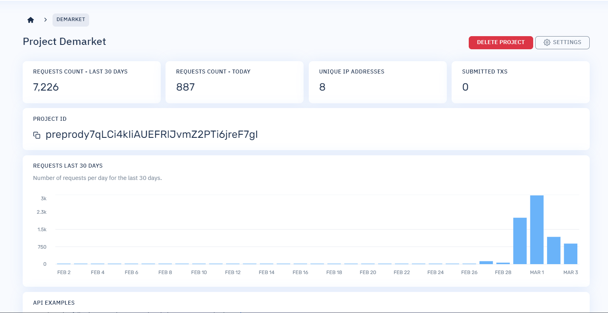
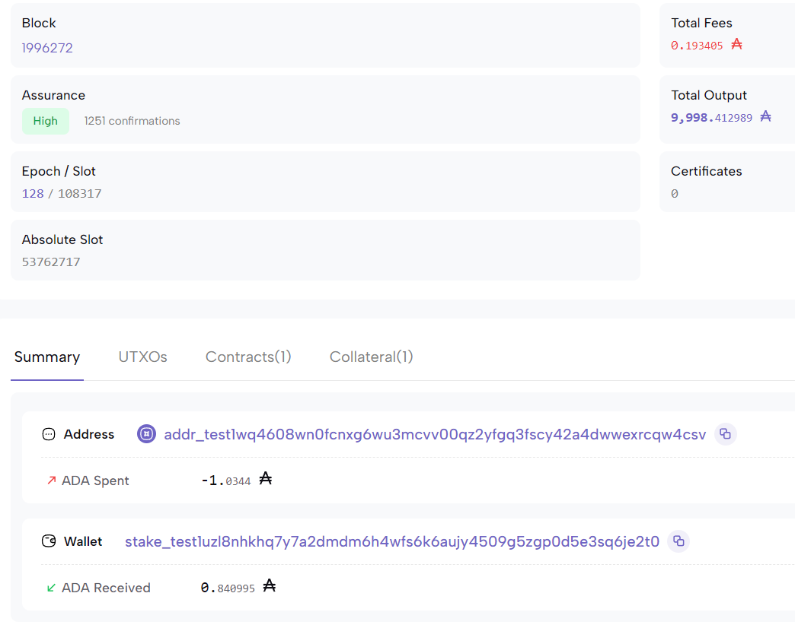

# Hello world - Lucid - CLI

Nội dung trong hướng dẫn này bao gồm

1. Nhận tiền thử nghiệm từ `Vòi Cardano`.
2. Tương tác với `validator` trên mạng `Preview`.
3. Đọc file `plutus.json` thực hiện viết chứa năng đọc `validator`
4. Sử dụng deno để tương tác với hợp đồng bằng `CMD`.
5. Sử dụng Cardano Scan để kiểm tra giao dịch.

### Điều kiện tiên quyết

Chúng tôi cho rằng bạn đã theo dõi `Hello, World!` Vì vậy, hãy thực hiện `các bước đầu tiên` , Aiken đã cài đặt một bản sẵn sàng để sử dụng. Chúng tôi cũng sẽ sử dụng `Lucid`, vì vậy hãy đảm bảo rằng bạn đã chuẩn bị sẵn môi trường phát triển cho một số `TypeScript`. Đối với TypeScript và phần còn lại của hướng dẫn này, chúng tôi khuyên bạn nên cài đặt deno.

### 1. Nhận tiền thử nghiệm từ `Vòi Cardano`.

Đối với hướng dẫn này, chúng tôi sẽ sử dụng trình xác thực mà chúng tôi đã xây dựng ở `Các bước đầu tiên` . Tuy nhiên, trước khi tiếp tục, chúng ta sẽ cần một số tiền và cặp khóa công khai/riêng tư để giữ chúng. Chúng tôi có thể tạo khóa riêng và địa chỉ bằng Lucid. Hãy viết code đầu tiên của chúng tôi là `generate-credentials.ts`:

```ts
import { Lucid } from "https://deno.land/x/lucid@0.8.3/mod.ts";

const lucid = await Lucid.new(undefined, "Preview");

const privateKey = lucid.utils.generatePrivateKey();
await Deno.writeTextFile("me.sk", privateKey);

const address = await lucid
    .selectWalletFromPrivateKey(privateKey)
    .wallet.address();
await Deno.writeTextFile("me.addr", address);
```

Bạn có thể chạy các hướng dẫn trên bằng Deno thông qua:

```sh
deno run --allow-net --allow-write generate-credentials.ts
```

Bây giờ, chúng ta có thể hướng tới vòi Cardano để nhận một số tiền trên mạng xem trước tới địa chỉ mới được tạo của chúng tôi (bên trong me.addr).


Đảm bảo chọn "Preview Testnet" làm mạng.

Sử dụng `CardanoScan` chúng ta có thể theo dõi vòi gửi một số ADA theo cách của chúng ta. Quá trình này sẽ khá nhanh (vài giây). Bây giờ chúng ta đã có một số tiền, chúng ta có thể khóa chúng trong hợp đồng mới tạo của mình. Chúng tôi sẽ sử dụng `Lucid` để xây dựng và gửi giao dịch của chúng tôi thông qua `Block Frost`. Đây chỉ là một ví dụ về khả năng thiết lập bằng các công cụ mà chúng tôi yêu thích. Để biết thêm công cụ, hãy nhớ xem Cổng thông tin dành cho nhà phát triển Cardano!

### 2. Tương tác với `validator` trên mạng `Preview`.

Đầu tiên, chúng tôi thiết lập Lucid với `Block Frost` làm nhà cung cấp. Điều này sẽ cho phép chúng tôi để `Lucid` xử lý việc xây dựng giao dịch cho chúng tôi, bao gồm cả việc quản lý các thay đổi. Nó cũng cung cấp cho chúng tôi một cách trực tiếp để gửi giao dịch sau này.

Tạo một tệp có tên hello-world-lock.tstrong thư mục gốc của dự án của bạn và thêm đoạn mã sau:

```ts
import {
    Blockfrost,
    C,
    Constr,
    Data,
    Lucid,
    SpendingValidator,
    TxHash,
    fromHex,
    toHex,
    utf8ToHex,
} from "https://deno.land/x/lucid@0.8.3/mod.ts";
import * as cbor from "https://deno.land/x/cbor@v1.4.1/index.js";

const lucid = await Lucid.new(
    new Blockfrost(
        "https://cardano-preview.blockfrost.io/api/v0",
        Deno.env.get("BLOCKFROST_PROJECT_ID")
    ),
    "Preview"
);
```

Lưu ý rằng dòng được đánh dấu ở trên sẽ tìm kiếm một biến môi trường có tên `BLOCKFROST_PROJECT_ID` mà giá trị của nó phải được đặt thành id dự án `Block Frost` của bạn. Bạn có thể xác định một biến môi trường mới trong thiết bị đầu cuối của mình bằng cách chạy (trong cùng phiên bạn cũng đang thực thi tập lệnh!):

```sh
export BLOCKFROST_PROJECT_ID=preview...
```



Thay thế `preview..`. bằng id dự án thực tế của bạn.

### 3. Đọc file `plutus.json` thực hiện viết chứa năng đọc `validator`

Tiếp theo, chúng ta sẽ cần đọc trình xác thực từ bản thiết kế (plutus.json) mà chúng ta đã tạo trước đó. Chúng tôi cũng cần chuyển đổi nó sang định dạng mà Lucid có thể hiểu được. Điều này được thực hiện bằng cách tuần tự hóa trình xác nhận và sau đó chuyển đổi nó thành chuỗi văn bản thập lục phân như dưới đây:

```ts
lucid.selectWalletFromPrivateKey(await Deno.readTextFile("./me.sk"));

async function readValidator(): Promise<SpendingValidator> {
    const validator = JSON.parse(await Deno.readTextFile("plutus.json"))
        .validators[0]; // Đọc validator từ plutus.json
    return {
        type: "PlutusV2",
        script: toHex(cbor.encode(fromHex(validator.compiledCode))), // sử dụng cbor-x để encode validator vừa tạo
    };
}

const validator = await readValidator();
```

### 4. Sử dụng deno để tương tác với hợp đồng bằng `CMD`.

##### 1. Khóa tiền vào hợp đồng

Bây giờ chúng ta có thể đọc trình xác thực của mình, chúng ta có thể thực hiện giao dịch đầu tiên để khóa tiền vào hợp đồng. Số liệu phải khớp với biểu diễn mà trình xác thực mong đợi (và như được chỉ định trong bản thiết kế), vì vậy đây là hàm tạo với một trường duy nhất là một mảng byte.

Đối với giá trị cho mảng byte đó, chúng tôi cung cấp bản tóm tắt băm của khóa chung của chúng tôi (từ ví được tạo bằng `me.sk`). Điều này sẽ cần thiết để mở khóa tiền.

```ts
// Tạo ra publickey hash từ địa chỉ trong khi kết nối với lucid
const publicKeyHash = lucid.utils.getAddressDetails(
    await lucid.wallet.address()
).paymentCredential?.hash;

const datum = Data.to(new Constr(0, [publicKeyHash]));

const txHash = await lock(1000000n, { into: validator, owner: datum });

await lucid.awaitTx(txHash);

console.log(`1 tADA locked into the contract at:
    Tx ID: ${txHash}
    Datum: ${datum}
`);

async function lock(
    lovelace: bigint,
    { into, owner }: { into: SpendingValidator; owner: string }
): Promise<TxHash> {
    const contractAddress = lucid.utils.validatorToAddress(into); // Đọc địa chỉ của hợp đồng

    const tx = await lucid
        .newTx()
        .payToContract(contractAddress, { inline: owner }, { lovelace }) // Gửi một số tiền và truyền datum vào hợp đồng
        .complete();
    const signedTx = await tx.sign().complete();
    return signedTx.submit();
}
```

Bạn có thể chạy đoạn trích trên bằng cách thực hiện:

```sh
deno run --allow-net --allow-read --allow-env hello-world-lock.ts
```

Đoạn mã trên yêu cầu bạn:

có một `BLOCKFROST_PROJECT_ID` bộ biến môi trường. Bạn có thể nhận được một cái bằng cách đăng ký tài khoản `Block Frost`.

đặt tập tin `hello-world-lock.t`csở thư mục gốc của `hello-world` thư mục của bạn.

Ở giai đoạn này, thư mục của bạn sẽ trông gần như thế này:

```sh
./hello-world
│
├── README.md
├── aiken.toml
├── plutus.json
├── generate-credentials.ts
├── hello-world-lock.ts
├── me.addr
├── me.sk
├── lib
│   └── ...
└── validators
    └── hello-world.ak
```

Nếu mọi việc suôn sẻ, bạn sẽ thấy một cái gì đó như thế này:

```sh
1 tADA locked into the contract at:
    Tx ID: 8559f57234407204d8e9a6bf57ef6943c65ec7119eb1c2ca6224f8bad8e71c1e
    Datum: d8799f581c10073fd2997d2f7dc6dadcf24966bd06b01930e5210e5de7aebf792dff
```

Bây giờ là thời điểm thích hợp để tạm dừng và xem CardanoScan. Dưới đây là ví dụ về giao dịch Hello Worldmà chúng tôi đã tạo bằng hướng dẫn này.


Nếu bạn nhận thấy biểu tượng nhỏ bên cạnh địa chỉ đầu ra hợp đồng, chúng tôi thậm chí có thể kiểm tra dữ liệu:

```sh
d8799f581c10073fd2997d2f7dc6dadcf24966bd06b01930e5210e5de7aebf792dff
{
  "constructor": 0,
  "fields": [
    {
      "bytes": "10073fd2997d2f7dc6dadcf24966bd06b01930e5210e5de7aebf792d"
    }
  ]
}
```

##### 2. Mở khóa tiền từ hợp đồng

Cuối cùng, bước cuối cùng: bây giờ chúng tôi muốn chi tiêu UTxO bị khóa bởi hello-worldhợp đồng của chúng tôi.

Cuối cùng, bước cuối cùng: bây giờ chúng tôi muốn chi tiêu UTxO bị khóa bởi `hello-world` hợp đồng của chúng tôi. Để hợp lệ, giao dịch của chúng tôi phải đáp ứng hai điều kiện: nó phải cung cấp "hello, Thế giới!" với tư cách là người cứu chuộc; Và nó phải được ký bởi khóa được tham chiếu là mốc (tức là chủ sở hữu). Hãy tạo một tệp mới `hello-world-unlock.ts` và sao chép một số bản soạn sẵn từ tệp đầu tiên.

nó phải cung cấp "hello, Thế giới!" với tư cách là người cứu chuộc; Và
nó phải được ký bởi khóa được tham chiếu là mốc (tức là chủ sở hữu).
Hãy tạo một tệp mới hello-world-unlock.tsvà sao chép một số bản soạn sẵn từ tệp đầu tiên.

```ts hello-world-unlock.ts
import {
    Blockfrost,
    C,
    Constr,
    Data,
    Lucid,
    SpendingValidator,
    TxHash,
    fromHex,
    toHex,
    utf8ToHex,
} from "https://deno.land/x/lucid@0.8.3/mod.ts";
import * as cbor from "https://deno.land/x/cbor@v1.4.1/index.js";

const lucid = await Lucid.new(
    new Blockfrost(
        "https://cardano-preview.blockfrost.io/api/v0",
        Deno.env.get("BLOCKFROST_PROJECT_ID")
    ),
    "Preview"
);

lucid.selectWalletFromPrivateKey(await Deno.readTextFile("./me.sk"));

const validator = await readValidator();

// Dọc validator từ hợp đồng thông minh
async function readValidator(): Promise<SpendingValidator> {
    const validator = JSON.parse(await Deno.readTextFile("plutus.json"))
        .validators[0];
    return {
        type: "PlutusV2",
        script: toHex(cbor.encode(fromHex(validator.compiledCode))),
    };
}
```

Bây giờ, hãy thêm các bit để mở khóa số tiền trong hợp đồng. Chúng tôi sẽ cần mã định danh giao dịch (tức là Tx ID) thu được khi bạn chạy tập lệnh trước đó ( hello-world-lock.ts)

Mã định danh giao dịch đó (còn gọi là hàm băm giao dịch) và chỉ số đầu ra tương ứng (ở đây, 0) xác định duy nhất UTxO (Đầu ra giao dịch chưa chi tiêu) trong đó số tiền hiện đang bị khóa. Và đó là thứ chúng ta sắp mở khóa.

Lưu ý rằng chúng ta cần thêm người ký một cách rõ ràng bằng cách sử dụng .addSignerđể nó được thêm vào extra_signatoriesgiao dịch của chúng ta—và có thể truy cập được bằng tập lệnh của chúng ta.

```ts
const utxo: OutRef = { txHash: Deno.args[0], outputIndex: 0 };

const redeemer = Data.to(new Constr(0, [utf8ToHex("Hello, World!")]));

const txHash = await unlock(utxo, {
    from: validator,
    using: redeemer,
});

await lucid.awaitTx(txHash);

console.log(`1 tADA unlocked from the contract
    Tx ID:    ${txHash}
    Redeemer: ${redeemer}
`);

async function unlock(
    ref: OutRef,
    { from, using }: { from: SpendingValidator; using: Redeemer }
): Promise<TxHash> {
    const [utxo] = await lucid.utxosByOutRef([ref]);

    const tx = await lucid
        .newTx() // Tạo một giao dịch
        .collectFrom([utxo], using) // Truyền UTXO[] và redeemer
        .addSigner(await lucid.wallet.address()) // Kí với địa chỉ
        .attachSpendingValidator(from) // gắn validator vào để thực hiện giao dịch
        .complete();

    const signedTx = await tx.sign().complete();
    const txHash = signedTx.submit();
    return txHash;
}
```

Chạy tập lệnh này như bình thường, nhưng lần này cũng chuyển id giao dịch thu được từ lệnh khóa tiền trước đó. Ví dụ:

```sh
deno run --allow-net --allow-read --allow-env hello-world-unlock.ts 8559f57234407204d8e9a6bf57ef6943c65ec7119eb1c2ca6224f8bad8e71c1e
```

Nếu mọi thứ hoạt động như kế hoạch, bạn sẽ thấy kết quả tương tự như sau:

```sh
1 tADA unlocked from the contract
    Tx ID:    d3d5e828a3989691b0960d22a265c8c9ae4723134b52aa05ec0fb7d40f060392
    Redeemer: d8799f4d48656c6c6f2c20576f726c6421ff
```

Chúng tôi có thể kiểm tra giao dịch đổi thưởng của mình trên `CardanoScan` và thấy rằng nó đã thực hiện thành công hợp đồng Hello World của chúng tôi.



Hy vọng điều này mang lại cho bạn ý tưởng về những gì bạn có thể xây dựng trên Cardano. Ví dụ này cũng sẽ minh họa cách hầu hết mã trong dapp của bạn thậm chí không phải là trình xác thực. Khi thiết kế các ứng dụng tận dụng Cardano, tốt hơn hết bạn nên suy nghĩ về loại giao dịch nào bạn sẽ cần xây dựng và sau đó viết trình xác thực để thực thi chúng. Một tài liệu tham khảo đầy đủ về ví dụ này có thể được tìm thấy ở đây.
