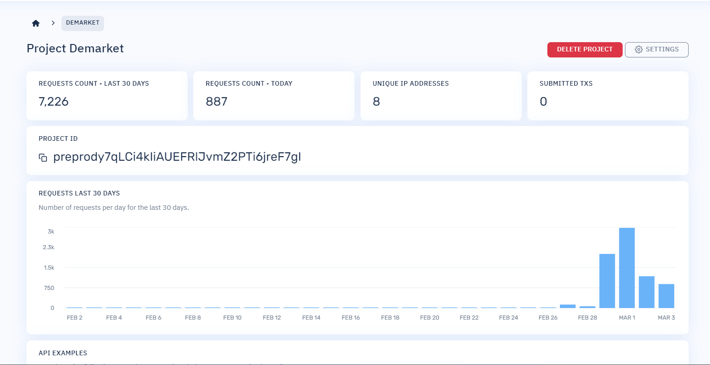
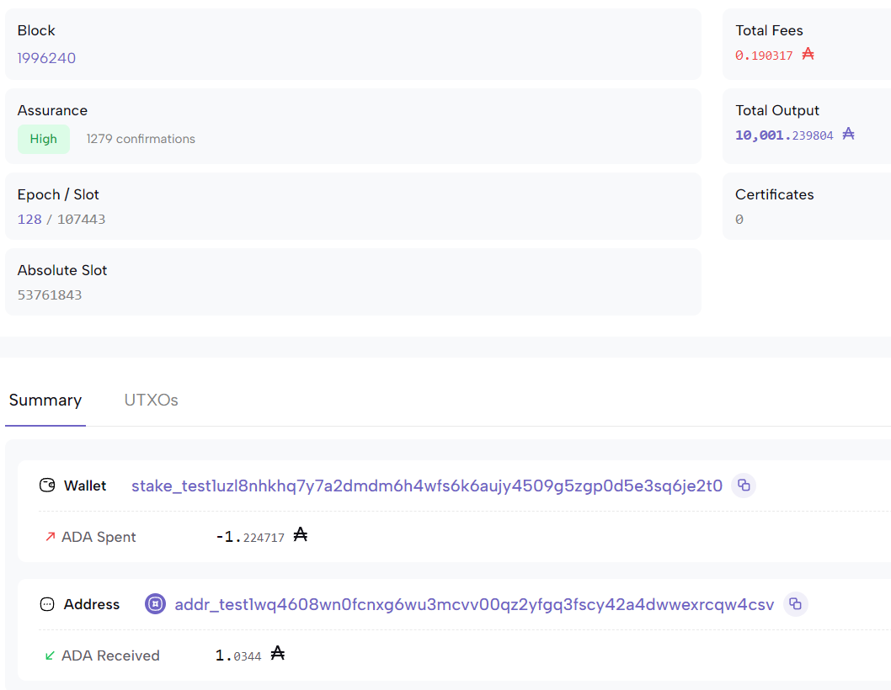

# Helloworld Smartcontract Frontend

Hiện nay, các bạn có thể viết một hợp đồng thông minh khá là có nhiều chức năng nhưng chúng ta không thể cho mọi người tương tác với chúng bằng commandline interface(CLI). Như vậy hãy tìm hiểu sâu hơn nữa bằng cách đưa nó đưa nó lên giao diện `frontend`.

## Nội dung bài học

1. Cài đặt một dự án frontend (`nextjs`)
2. Cách lấy file `plutus.json` và đọc `validator` được biên dịch trong khi biên dịch hợp đồng thông minh
3. Định nghĩa `Datum` và `Redeemer` ứng với hợp đồng thông minh
4. Tạo một giao diện cơ bản
5. Thực hiện kết nối ví (Nami)
6. Viết các hàm `Lock` và `UnLock` để tương tác với hợp đồng
7. Tương tác giao diện với hợp đồng thông minh

### 1. Cài đặt dự án frontend - nextjs

Trong dự án này chúng ta sẻ sử dụng `Nextjs` làm công cụ để xây dựng ra các tính năng tương tác với hợp đồng thông minh `hello world` để có thể sử dụng được `Nextjs` thì điểu kiên tiên quyết phải có là `Nodejs` bằng cách kiểm tra

```sh
node --version
> v18.17.0
```

`NodeJs` nên sử dụng ưu tiên từ `version 16` trở nên. đồng thời với `Nodejs` là `npm` và `npx`. Được rồi để tạo dự án chúng ta cần sử dụng.

```sh
npx create-next-app@latest helloworld-frontend
cd helloworld-frontend
npm run dev
```

Dự án được chạy trên PORT 3000 như vậy dự án được cài đặt thành công. Trong dự án này còn có hai thư viện quan trong khác cần phải được cài đặt đó là `lucid-cardano` và `cbor-x`. Hai thư viện này chịu trách nhiệm chính trong việc tương tác với hợp đồng thông minh. Khi đã cài đặt thành công hay bắt đầu một bài học thú vị hơn.

```sh
npm install lucid-cardano cbor-x
```

### 2. Cách lấy file `plutus.json` và đọc `validator` được biên dịch trong khi biên dịch hợp đồng thông minh

Khi `aiken build` thì chúng ta cũng đã biên địch được hợp đồng và từ đó file `plutus.json` được tạo. Tiếp đến thực hiện việc copy file và đưa và dự án `frontend` bằng cách tạo thư mục `libs` trong `src`.

giờ đây chỉ cần viết một hàm đọc `validator`

```ts
import { encode } from "cbor-x";
import { SpendingValidator, fromHex, toHex } from "lucid-cardano";
import helloWorld from "~/libs/helloworld.json";

const readValidator = function (): SpendingValidator {
    // Tìm validator trong hợp đồng thông minh Helloworld
    const helloWorldValidator = helloWorld.validators.find(function (
        validator
    ) {
        return validator.title === "contract.hello_world";
    });

    // Kiểm tra sự tồn tại của validator
    if (!helloWorldValidator) {
        throw new Error("Hello world validator not found.");
    }

    // Endcode validator từ hợp đồng bằng cbor-x để lucid có thể hiểu và tương tác với chúng
    const helloWorldScript: string = toHex(
        encode(fromHex(helloWorldValidator.compiledCode))
    );

    // Trả về định dạng của validator để tương tác với hợp đồng
    return {
        type: "PlutusV2",
        script: helloWorldScript,
    };
};

export default readValidator;
```

Trong đây, Hàm đọc `validator` thực chất thực hiện đọc trình xác thực từ bản thiết kế (`plutus.json`) mà chúng ta đã tạo trước đó. Chúng tôi cũng cần chuyển đổi nó sang định dạng mà `Lucid` có thể hiểu được. Điều này được thực hiện bằng cách tuần tự hóa trình xác nhận và sau đó chuyển đổi nó thành chuỗi văn bản thập lục phân.

### 3. Định nghĩa Datum và Redeemer ứng với hợp đồng thông minh

Thực hiện tạo folder `constants` trong thư mục `src` sau đó thực hiện tạo các file `datum.ts` và `redeemer.ts` với mục đích xây dựng ra các điều kiện đầu vào cho hợp đồng thông minh. Định nghĩa các `Datum` ứng với các giá trị mà chúng ta đã định nghĩa `Datum` trong hợp đồng và khi đưa vào Lucid nó có thể hiểu được. Định nghĩa một `Datum` `Owner` có kiểu dữ liệu là `ByteArray` map với kiểu `String` trong hợp đồng và thực hiện `export` để sử dụng cho các điều kiên giao dịch. `Datum` là một phần thông tin có thể được liên kết với `UTXO` và được sử dụng để mang thông tin trạng thái tập lệnh như chủ sở hữu của nó hoặc chi tiết thời gian

```ts
import { Data } from "lucid-cardano";
const HelloWorldDatumSchema = Data.Object({
    owner: Data.Bytes(), // Owner có dạng string map với bytearray
});
type HelloWorldDatum = Data.Static<typeof HelloWorldDatumSchema>;
export const HelloWorldDatum =
    HelloWorldDatumSchema as unknown as HelloWorldDatum;
```

Tương tự với `Datum` , `Redeemer` được định nghĩa là giống như một chiếc chìa khóa giúp mở khóa các utxos bị khóa trong tập lệnh. Với dữ liệu chính xác và giá trị quy đổi, utxo sau đó có thể được mở khóa để chi tiêu trong đây message `Hello, World!` được sử dụng để thực hiện để mở khóa hợp đồng thông minh.

```ts
import { Data } from "lucid-cardano";

const HelloWorldRedeemerSchema = Data.Object({
    msg: Data.Bytes(), // msg "Hello, World!"
});

type HelloWorldRedeemer = Data.Static<typeof HelloWorldRedeemerSchema>;
export const HelloWorldRedeemer =
    HelloWorldRedeemerSchema as unknown as HelloWorldRedeemer;
```

### 4. Tạo một giao diện cơ bản

Trong hướng dẫn này sẽ giúp tạo một giao diện cơ bản bằng sử dụng `tailwindcss` để thực hiện render ra `validator` từ `read-validator.ts` đã tạo

```tsx
import React from "react";
import readValidator from "~/utils/read-validators";
import HelloWorld from "~/components/HelloWorld";
export default function Home() {
    const validators = readValidator(); // Đọc validator từ hợp đồng
    return (
        <main>
            <div className="max-w-2xl mx-auto mt-20 mb-10">
                <div className="mb-10">
                    <h2 className="text-lg font-semibold text-gray-900">
                        Make a lock and un lock tada contract
                    </h2>

                    <h3 className="mt-4 mb-2">Hello world</h3>
                    <div className="bg-gray-200 p-2 rounded overflow-x-scroll">
                        {validators.script} {/*Render validator*/}
                    </div>
                </div>
            </div>
        </main>
    );
}
```

Giao diện được hiển thị như sau:


### 5. Thực hiện kết nối ví

Thực hiện tạo folder `contexts` trong thư mục `src` sau đó viết các chức năng connect wallet và disconnect wallet thông qua Lucid và Api của blockfrost

```tsx
"use client";

import React, { ReactNode, useContext, useState } from "react";
import { Blockfrost, Lucid } from "lucid-cardano";
import WalletContext from "~/contexts/components/WalletContext";
import LucidContext from "~/contexts/components/LucidContext";
import { LucidContextType } from "~/types/contexts/LucidContextType";

type Props = {
    children: ReactNode;
};

const WalletProvider = function ({ children }: Props) {
    const { setLucid } = useContext<LucidContextType>(LucidContext);

    // Chức năng thực hiện connect ví
    const connect = async function () {
        try {
            const lucid: Lucid = await Lucid.new(
                new Blockfrost(
                    process.env.BLOCKFROST_PROPROD_RPC_URL as string,
                    process.env.BLOCKFROST_PROPROD_API as string
                ),
                "Preprod"
            );

            // chọn ví Nami để tương tác với hợp đồng thông minh thông thông qua lucid và api blockfrost
            lucid.selectWallet(await window.cardano.nami.enable());
            setLucid(lucid);
        } catch (error) {
            console.log(error);
        }
    };

    const disconnect = async function () {
        try {
            setLucid(null!);
        } catch (error) {
            console.log(error);
        }
    };

    return (
        <WalletContext.Provider
            value={{
                connect,
                disconnect,
            }}
        >
            {children}
        </WalletContext.Provider>
    );
};

export default WalletProvider;
```

Bây giờ, chúng ta có thể hướng tới vòi Cardano để nhận một số tiền trên mạng xem trước tới địa chỉ mới được tạo của chúng tôi (bên trong me.addr).


Đảm bảo chọn "Preview Testnet" làm mạng. Thực hiên copy địa chỉ mà đã sinh ra từ trước và paste vào để nhận một số đồng tiền test. Sử dụng `CardanoScan` chúng ta có thể theo dõi vòi gửi một số ADA theo cách của chúng ta. Quá trình này sẽ khá nhanh (vài giây). Bây giờ chúng ta đã có một số tiền, chúng ta có thể khóa chúng trong hợp đồng mới tạo của mình. Chúng tôi sẽ sử dụng `Lucid` để xây dựng và gửi giao dịch của chúng tôi thông qua `Block Frost`. Đây chỉ là một ví dụ về khả năng thiết lập bằng các công cụ mà chúng tôi yêu thích. Để biết thêm công cụ, hãy nhớ xem Cổng thông tin dành cho nhà phát triển Cardano! Đầu tiên, chúng tôi thiết lập Lucid với `Block Frost` làm nhà cung cấp. Điều này sẽ cho phép chúng tôi để `Lucid` xử lý việc xây dựng giao dịch cho chúng tôi, bao gồm cả việc quản lý các thay đổi. Nó cũng cung cấp cho chúng tôi một cách trực tiếp để gửi giao dịch sau này.

Lưu ý rằng dòng được đánh dấu ở trên sẽ tìm kiếm một biến môi trường có tên `BLOCKFROST_PROJECT_ID` mà giá trị của nó phải được đặt thành id dự án `Block Frost` của bạn. Bạn có thể xác định một biến môi trường mới trong thiết bị đầu cuối của mình bằng cách chạy (trong cùng phiên bạn cũng đang thực thi tập lệnh):

```sh
export BLOCKFROST_PROJECT_ID=preprody7qLCi4kIiAUEFRlJvmZ2PTi6jreF7gI
```



Bây giờ hãy tạo một folder `components` sau đó thực hiện hiết `HelloWorld.ts` Đây chính là nơi để thực hiện tương tác trực tiếp với họp đồng thông minh thông qua giao diện.

```tsx
"use client";

import { Blockfrost, Constr, Data, Lucid, fromText } from "lucid-cardano";
import React, {
    ChangeEvent,
    useEffect,
    useState,
    lazy,
    useContext,
} from "react";

import Link from "next/link";
import { SmartContractContextType } from "~/types/contexts/SmartContractContextType";
import SmartContractContext from "~/contexts/components/SmartContractContext";
import { LucidContextType } from "~/types/contexts/LucidContextType";
import LucidContext from "~/contexts/components/LucidContext";
import { WalletContextType } from "~/types/contexts/WalletContextType";
import WalletContext from "~/contexts/components/WalletContext";

type Props = {};

const HelloWorld = function ({}: Props) {
    const {
        tADA,
        setTADA,
        lockHelloworld,
        unLockHelloword,
        lockTxHash,
        unlockTxHash,
        waitingLockTx,
        waitingUnlockTx,
    } = useContext<SmartContractContextType>(SmartContractContext);
    const { lucid } = useContext<LucidContextType>(LucidContext);
    const { connect } = useContext<WalletContextType>(WalletContext);

    return (
        <div>
            {!lucid && (
                <div className="mt-10 grid grid-cols-1 gap-y-8">
                    <button
                        className="group inline-flex items-center justify-center rounded-full py-2 px-4 text-sm font-semibold focus:outline-none bg-blue-600 text-white hover:bg-blue-500 active:bg-blue-800 active:text-blue-100"
                        onClick={connect}
                    >
                        Connect Wallet
                    </button>
                </div>
            )}
        </div>
    );
};

export default HelloWorld;
```

Trước tiên hay thực hiện các chức năng kết nối ví. Trong đây mình sẽ sử dụng `Nami` là ví chính để thực hiện tương tác với cardano.

### 5. Thực hiện Lock tài sản vào hợp đồng thông minh

Khi nếu nối ví thành công tiếp theo cần thực hiện một vài thao tác để tương tác với hợp đông thông minh. Trước tiên là Lock tài sản. Bây giờ chúng ta có thể đọc trình xác thực của mình, chúng ta có thể thực hiện giao dịch đầu tiên để khóa tiền vào hợp đồng. Số liệu phải khớp với biểu diễn mà trình xác thực mong đợi (và như được chỉ định trong bản thiết kế), vì vậy đây là hàm tạo với một trường duy nhất là một mảng byte.

Đối với giá trị cho mảng byte đó, chúng tôi cung cấp bản tóm tắt băm của khóa chung của chúng tôi (từ ví của Lucid khi connect). Điều này sẽ cần thiết để mở khóa tiền.

```ts
import {
    Lucid,
    Script,
    TxHash,
    Data,
    TxComplete,
    TxSigned,
} from "lucid-cardano";
import { HelloWorldDatum } from "~/constants/datum";
import readValidator from "~/utils/read-validators";

type Props = {
    lovelace: bigint;
    lucid: Lucid;
};

const lockHelloWorld = async function ({
    lucid,
    lovelace,
}: Props): Promise<TxHash> {
    // Đọc địa chỉ payment hash
    const ownerPublicKeyHash = lucid.utils.getAddressDetails(
        await lucid.wallet.address()
    ).paymentCredential?.hash!;

    // Định nghĩa datum do payment hash
    const datum = Data.to(
        {
            owner: ownerPublicKeyHash,
        },
        HelloWorldDatum
    );

    // Đọc validator và render địa chỉ của hợp đồng
    const validator: Script = readValidator();
    const contractAddress = lucid.utils.validatorToAddress(validator);

    // Soạn giao dịch và thực hiện kí
    const tx: TxComplete = await lucid
        .newTx()
        .payToContract(
            contractAddress,
            { inline: datum },
            { lovelace: lovelace }
        )
        .complete();

    const signedTx: TxSigned = await tx.sign().complete();
    const txHash: TxHash = await signedTx.submit();
    await lucid.awaitTx(txHash);
    return txHash;
};

export default lockHelloWorld;
```

Bổ sung vào HelloWorld.ts thí sẽ được kết quả

```tsx
"use client";

import { Blockfrost, Constr, Data, Lucid, fromText } from "lucid-cardano";
import React, {
    ChangeEvent,
    useEffect,
    useState,
    lazy,
    useContext,
} from "react";

import Link from "next/link";
import { SmartContractContextType } from "~/types/contexts/SmartContractContextType";
import SmartContractContext from "~/contexts/components/SmartContractContext";
import { LucidContextType } from "~/types/contexts/LucidContextType";
import LucidContext from "~/contexts/components/LucidContext";
import { WalletContextType } from "~/types/contexts/WalletContextType";
import WalletContext from "~/contexts/components/WalletContext";

type Props = {};

const HelloWorld = function ({}: Props) {
    const {
        tADA,
        setTADA,
        lockHelloworld,
        unLockHelloword,
        lockTxHash,
        unlockTxHash,
        waitingLockTx,
        waitingUnlockTx,
    } = useContext<SmartContractContextType>(SmartContractContext);
    const { lucid } = useContext<LucidContextType>(LucidContext);
    const { connect } = useContext<WalletContextType>(WalletContext);

    return (
        <div>
            // ... continue ...
            {lucid && (
                <div>
                    <div className="mt-10 grid grid-cols-1 gap-y-8">
                        <input
                            type="text"
                            name="giftADA"
                            id="giftADA"
                            value={tADA}
                            className="block w-full appearance-none rounded-md border border-gray-200 bg-gray-50 px-3 py-2 text-gray-900 placeholder-gray-400 focus:border-blue-500 focus:bg-white focus:outline-none focus:ring-blue-500 sm:text-sm"
                            onChange={(e) => setTADA(e.target.value)}
                        />

                        <button
                            className="group inline-flex items-center justify-center rounded-full py-2 px-4 text-sm font-semibold focus:outline-none bg-blue-600 text-white hover:bg-blue-500 active:bg-blue-800 active:text-blue-100"
                            onClick={() => lockHelloworld({ lucid })}
                            disabled={waitingLockTx || !!lockTxHash}
                        >
                            {waitingLockTx ? "Waiting for Tx..." : "Locks ADA"}
                        </button>

                        {lockTxHash && (
                            <div className="mt-10 grid grid-cols-1 gap-y-8">
                                <h3 className="mt-4 mb-2">ADA Locked</h3>
                                <Link
                                    className="mb-2"
                                    target="_blank"
                                    href={`https://preprod.cardanoscan.io/transaction/${lockTxHash}`}
                                >
                                    {lockTxHash}
                                </Link>
                            </div>
                        )}
                    </div>
                </div>
            )}
        </div>
    );
};

export default HelloWorld;
```

Chúng ta kết nối ví và thực hiện Lock 1 ADA vào hợp đồng khi đó giao diện sẽ có dạng như sau


Khi giao dịch thực hiện thành công transaction hash được in lên màn hình khi đó có thể kiếm tra giao dịch bằng cách click và transaction hash đó để sang cardano scan để kiểm tra.



Như vậy quá trình lock tài sản được thực hiện thành công.

### 6. Thực hiện Un Lock tài sản khỏi hợp đồng thông minh

Cuối cùng, bước cuối cùng: bây giờ chúng tôi muốn chi tiêu UTxO bị khóa bởi `hello-world` hợp đồng của chúng tôi. Để hợp lệ, giao dịch của chúng tôi phải đáp ứng hai điều kiện: nó phải cung cấp "hello, World!" với tư cách là `redeemer`. Và nó phải được ký bởi khóa được tham chiếu là mốc (tức là chủ sở hữu). Hãy tạo một tệp mới `un-lock.ts` và sao chép một số bản soạn sẵn từ tệp đầu tiên.

```ts
import {
    Constr,
    Data,
    Lucid,
    Redeemer,
    Script,
    TxComplete,
    TxHash,
    TxSigned,
    UTxO,
    fromText,
} from "lucid-cardano";
import { HelloWorldRedeemer } from "~/constants/redeemer";
import readValidator from "~/utils/read-validators";

type Props = {
    lucid: Lucid;
};

const unLockHelloWorld = async function ({ lucid }: Props): Promise<TxHash> {
    const redeemer = Data.to(
        { msg: fromText("Hello, World!") },
        HelloWorldRedeemer
    );
    const validator: Script = readValidator();
    const contractAddress: string = lucid.utils.validatorToAddress(validator);
    const scriptUtxos = await lucid.utxosAt(contractAddress);

    const tx: TxComplete = await lucid
        .newTx()
        .collectFrom(scriptUtxos, redeemer)
        .attachSpendingValidator(validator)
        .addSigner(await lucid.wallet.address())
        .complete();

    const signedTx: TxSigned = await tx.sign().complete();

    const txHash: TxHash = await signedTx.submit();
    await lucid.awaitTx(txHash);
    return txHash;
};

export default unLockHelloWorld;
```

Bây giờ sẽ thực hiện một số thay đổi để có thể thực hiện chức năng un lock tài sản và in ra transaction hash khi kí giao dich.

```tsx
"use client";

import { Blockfrost, Constr, Data, Lucid, fromText } from "lucid-cardano";
import React, {
    ChangeEvent,
    useEffect,
    useState,
    lazy,
    useContext,
} from "react";

import Link from "next/link";
import { SmartContractContextType } from "~/types/contexts/SmartContractContextType";
import SmartContractContext from "~/contexts/components/SmartContractContext";
import { LucidContextType } from "~/types/contexts/LucidContextType";
import LucidContext from "~/contexts/components/LucidContext";
import { WalletContextType } from "~/types/contexts/WalletContextType";
import WalletContext from "~/contexts/components/WalletContext";

type Props = {};

const HelloWorld = function ({}: Props) {
    const {
        tADA,
        setTADA,
        lockHelloworld,
        unLockHelloword,
        lockTxHash,
        unlockTxHash,
        waitingLockTx,
        waitingUnlockTx,
    } = useContext<SmartContractContextType>(SmartContractContext);
    const { lucid } = useContext<LucidContextType>(LucidContext);
    const { connect } = useContext<WalletContextType>(WalletContext);

    return (
        <div>
            // ... continue ...
            {lucid && (
                <div>
                    <div className="mt-10 grid grid-cols-1 gap-y-8">
                        <input
                            type="text"
                            name="giftADA"
                            id="giftADA"
                            value={tADA}
                            className="block w-full appearance-none rounded-md border border-gray-200 bg-gray-50 px-3 py-2 text-gray-900 placeholder-gray-400 focus:border-blue-500 focus:bg-white focus:outline-none focus:ring-blue-500 sm:text-sm"
                            onChange={(e) => setTADA(e.target.value)}
                        />

                        <button
                            className="group inline-flex items-center justify-center rounded-full py-2 px-4 text-sm font-semibold focus:outline-none bg-blue-600 text-white hover:bg-blue-500 active:bg-blue-800 active:text-blue-100"
                            onClick={() => lockHelloworld({ lucid })}
                            disabled={waitingLockTx || !!lockTxHash}
                        >
                            {waitingLockTx ? "Waiting for Tx..." : "Locks ADA"}
                        </button>

                        {lockTxHash && (
                            <div className="mt-10 grid grid-cols-1 gap-y-8">
                                <h3 className="mt-4 mb-2">ADA Locked</h3>
                                <Link
                                    className="mb-2"
                                    target="_blank"
                                    href={`https://preprod.cardanoscan.io/transaction/${lockTxHash}`}
                                >
                                    {lockTxHash}
                                </Link>
                                <button
                                    className="group inline-flex items-center justify-center rounded-full py-2 px-4 text-sm font-semibold focus:outline-none bg-blue-600 text-white hover:bg-blue-500 active:bg-blue-800 active:text-blue-100"
                                    onClick={() => unLockHelloword({ lucid })}
                                    disabled={waitingLockTx || !!unlockTxHash}
                                >
                                    {waitingUnlockTx
                                        ? "Waiting for Tx..."
                                        : "Unlocks ADA"}
                                </button>
                            </div>
                        )}
                        {unlockTxHash && (
                            <>
                                <h3 className="mt-4 mb-2">ADA Unlocked</h3>
                                <Link
                                    className="mb-2"
                                    target="_blank"
                                    href={`https://preprod.cardanoscan.io/transaction/${unlockTxHash}`}
                                >
                                    {unlockTxHash}
                                </Link>
                            </>
                        )}
                    </div>
                </div>
            )}
        </div>
    );
};

export default HelloWorld;
```


Khi thực hiện kí giao dịch thì transaction hash được in ra chứng to giao dịch thành công và chúng ta có thể check lại ví của mình xem đã nhận được đủ số ada trong tài khoản hoặc lên cardano scan để kiếm tra giao dịch.


Như vậy bài học này đã nói tổng quan qua cách triển khai việc tương tác với hợp đồng thông minh với giao diện frontend Thay vì với các dòng lên command line giúp cho việc thực hiện các chức năng được dễ dàng hơn.
