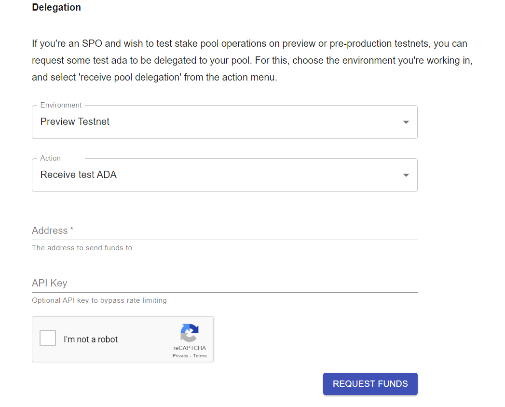

# Vesting Smartcontract Commandline Interface

Khi mới bắt đầu, chúng ta cần khóa tiền trong hợp đồng mới tạo của mình. Chúng tôi sẽ sử dụng `Lucid` để xây dựng và gửi giao dịch của chúng tôi thông qua `BlockFrost`.

Đây chỉ là một ví dụ về khả năng thiết lập bằng các công cụ mà chúng tôi yêu thích. Để biết thêm công cụ, hãy nhớ xem Cổng thông tin dành cho nhà phát triển Cardano!

## Nội dung bài học

1. Nhận tiền thử nghiệm từ `Cardano Faucet`.
2. Tương tác với `validator` trên mạng `Preview`.
3. Đọc file `plutus.json` thực hiện viết chứa năng đọc `validator`.
4. Sử dụng deno để tương tác với hợp đồng bằng `CMD`.
5. Sử dụng `Cardano Scan` để kiểm tra giao dịch.

## Điều kiện tiên quyết

### 1. Nhận tiền thử nghiệm từ `Cardano Faucet`.

Đối với hướng dẫn này, chúng ta sẽ sử dụng trình xác thực mà chúng ta đã xây dựng ở Các bước đầu tiên. Tuy nhiên, trước khi tiếp tục, chúng ta sẽ cần một số tiền và `public key` và `private key` để giữ chúng. Chúng ta có thể tạo khóa riêng và địa chỉ bằng `Lucid`. Như vậy, hãy viết đoạn mã đầu tiên để thực hiện làm việc trên `generate-credentials.ts`:

```ts
import { Lucid } from "https://deno.land/x/lucid@0.8.3/mod.ts";

const lucid = await Lucid.new(undefined, "Preview");

const ownerPrivateKey = lucid.utils.generatePrivateKey();
await Deno.writeTextFile("owner.sk", ownerPrivateKey);

const ownerAddress = await lucid
    .selectWalletFromPrivateKey(ownerPrivateKey)
    .wallet.address();
await Deno.writeTextFile("owner.addr", ownerAddress);

const beneficiaryPrivateKey = lucid.utils.generatePrivateKey();
await Deno.writeTextFile("beneficiary.sk", beneficiaryPrivateKey);

const beneficiaryAddress = await lucid
    .selectWalletFromPrivateKey(beneficiaryPrivateKey)
    .wallet.address();
await Deno.writeTextFile("beneficiary.addr", beneficiaryAddress);
```

Bạn có thể chạy các hướng dẫn trên bằng `Deno` thông qua:

```sh
deno run --allow-net --allow-write generate-credentials.ts
```

Bây giờ, chúng ta có thể hướng tới `Cardano Faucet` để nhận một số tiền trên mạng testnet `Preprod` tới địa chỉ mới được tạo của chúng tôi `me.addr`.



Đảm bảo chọn `Preprod Testnet` làm mạng.

Sử dụng `CardanoScan` chúng ta có thể theo dõi việc gửi một số ADA vào ví của chúng ta vừa tạo. Quá trình này sẽ khá nhanh và sẽ mất vài giây. Bây giờ chúng ta đã có một số tiền ADA test, chúng ta có thể khóa chúng trong hợp đồng mới tạo của chúng ta. Chúng ta sẽ sử dụng `Lucid` để xây dựng và gửi giao dịch của chúng tôi thông qua `Block Frost`. Đây chỉ là một ví dụ về khả năng thiết lập bằng các công cụ mà chúng ta yêu thích. Để biết thêm công cụ, hãy nhớ xem cổng thông tin dành cho nhà phát triển Cardano!

### 2. Tương tác với `validator` trên mạng `Preprod`.

Đầu tiên, chúng ta thiết lập `Lucid` với `Block Frost` làm nhà cung cấp. Điều này sẽ cho phép chúng ta để `Lucid` xử lý việc xây dựng giao dịch cho chúng ta, bao gồm cả việc quản lý các thay đổi. Nó cũng cung cấp cho chúng ta một cách trực tiếp để gửi giao dịch sau này.

Tạo một tệp có tên `vesting-lock.ts` trong thư mục gốc của dự án của bạn và thêm đoạn mã sau:

```ts
import {
    Blockfrost,
    C,
    Constr,
    Data,
    Lucid,
    SpendingValidator,
    TxHash,
    fromHex,
    toHex,
    utf8ToHex,
} from "https://deno.land/x/lucid@0.8.3/mod.ts";
import * as cbor from "https://deno.land/x/cbor@v1.4.1/index.js";

// Khởi tạo Lucid sử dụng API của BLOCKFROST
const lucid = await Lucid.new(
    new Blockfrost(
        "https://cardano-preview.blockfrost.io/api/v0",
        Deno.env.get("BLOCKFROST_PROJECT_ID")
    ),
    "Preview"
);
```

Lưu ý rằng dòng được đánh dấu ở trên sẽ tìm kiếm một biến môi trường có tên `BLOCKFROST_PROJECT_ID` mà giá trị của nó phải được đặt thành id dự án `Block Frost` của bạn. Bạn có thể xác định một biến môi trường mới trong thiết bị đầu cuối của mình bằng cách chạy (trong cùng phiên bạn cũng đang thực thi tập lệnh!):

```sh
export BLOCKFROST_PROJECT_ID=preprod...
```


Thay thế `preview..`. bằng id dự án thực tế của bạn.

### 3. Đọc file `plutus.json` thực hiện viết chứa năng đọc `validator`

Tiếp theo, chúng ta sẽ cần đọc trình xác thực từ bản thiết kế (plutus.json) mà chúng ta đã tạo trước đó. Chúng tôi cũng cần chuyển đổi nó sang định dạng mà Lucid có thể hiểu được. Điều này được thực hiện bằng cách tuần tự hóa trình xác nhận và sau đó chuyển đổi nó thành chuỗi văn bản thập lục phân như dưới đây:

```ts
lucid.selectWalletFromPrivateKey(await Deno.readTextFile("./me.sk"));

async function readValidator(): Promise<SpendingValidator> {
    const validator = JSON.parse(await Deno.readTextFile("plutus.json"))
        .validators[0]; // Đọc validator từ plutus.json
    return {
        type: "PlutusV2",
        script: toHex(cbor.encode(fromHex(validator.compiledCode))), // sử dụng cbor-x để encode validator vừa tạo
    };
}

const validator = await readValidator();
```

### 4. Sử dụng deno để tương tác với hợp đồng bằng `Command Line Interface`.

##### 1. Khóa tiền vào hợp đồng

Bây giờ chúng ta có thể đọc trình xác thực của hợp đồng, chúng ta có thể thực hiện giao dịch đầu tiên để khóa tiền vào hợp đồng. Số liệu phải khớp với biểu diễn mà trình xác thực mong đợi (và như được chỉ định trong bản thiết kế), vì vậy đây là hàm tạo với một trường duy nhất là một mảng byte.

Đối với giá trị cho mảng byte đó, chúng tôi cung cấp bản tóm tắt băm của khóa chung của chúng tôi (từ ví được tạo bằng `me.sk`). Điều này sẽ cần thiết để mở khóa tiền.

Nếu bạn đã cài đặt deno, bạn có thể chạy ngoại trừ ở trên bằng cách thực thi:

```sh
deno run --allow-net --allow-read --allow-env vesting_lock.ts
```

Nó giả định rằng tập tin này (`vesting_lock.ts`) được đặt ở thư mục gốc của `vesting` thư mục của bạn. Ở giai đoạn này, thư mục của bạn sẽ trông gần như thế này:

```
./vesting
│
├── README.md
├── aiken.toml
├── plutus.json
├── vesting_lock.ts
├── owner.addr
├── owner.sk
├── beneficiary.addr
├── beneficiary.sk
├── lib
│   └── ...
└── validators
    └── vesting.ak
```

Tại đây, chúng tôi thực hiện giao dịch đầu tiên để khóa tiền vào hợp đồng. Dữ liệu phải khớp với biểu diễn mà tập lệnh mong đợi, hàm tạo là một đối tượng mong đợi 3 trường.

```ts
const ownerPublicKeyHash = lucid.utils.getAddressDetails(
    await lucid.wallet.address()
).paymentCredential.hash;

const beneficiaryPublicKeyHash = lucid.utils.getAddressDetails(
    await Deno.readTextFile("beneficiary.addr")
).paymentCredential.hash;

const Datum = Data.Object({
    lock_until: Data.BigInt,
    owner: Data.String,
    beneficiary: Data.String,
});

type Datum = Data.Static<typeof Datum>;

const datum = Data.to<Datum>(
    {
        lock_until: 1672843961000n,
        owner: ownerPublicKeyHash,
        beneficiary: beneficiaryPublicKeyHash,
    },
    Datum
);

const txLock = await lock(1000000, { into: validator, datum: datum });

await lucid.awaitTx(txLock);

console.log(`1 tADA locked into the contract
    Tx ID: ${txLock}
    Datum: ${datum}
`);

async function lock(lovelace, { into, datum }): Promise<TxHash> {
    const contractAddress = lucid.utils.validatorToAddress(into);

    const tx = await lucid
        .newTx()
        .payToContract(contractAddress, { inline: datum }, { lovelace })
        .complete();
    const signedTx = await tx.sign().complete();
    return signedTx.submit();
}
```

Nếu mọi việc suôn sẻ, bạn sẽ thấy một cái gì đó như thế này:

```sh
1 tADA locked into the contract at:
    Tx ID: 8559f57234407204d8e9a6bf57ef6943c65ec7119eb1c2ca6224f8bad8e71c1e
    Datum: d8799f581c10073fd2997d2f7dc6dadcf24966bd06b01930e5210e5de7aebf792dff
```

Bây giờ là thời điểm thích hợp để tạm dừng và xem `CardanoScan`. Dưới đây là ví dụ về giao dịch `Vesting` mà chúng tôi đã tạo bằng hướng dẫn này.


### Mở khóa tiền từ hợp đồng

Bây giờ chúng ta có thể sử dụng một ví khác (người thụ hưởng.sk). Ví này sẽ là ví thụ hưởng đã được thêm vào dữ liệu ở bước trước (khóa).

Cuối cùng, bước cuối cùng: bây giờ chúng tôi muốn chi tiêu UTxO bị khóa bởi `vesting` hợp đồng của chúng tôi.

Để hợp lệ, giao dịch của chúng tôi phải đáp ứng một trong hai điều kiện:
nó phải có chữ ký của chủ sở hữu (được coi là "chủ sở hữu" trong mốc thời gian); hoặc
nó phải được ký bởi người thụ hưởng được tham chiếu là "người thụ hưởng" trong dữ liệu VÀ thời gian phải vượt quá ngưỡng chúng tôi đã ấn định -- nghĩa là nó phải muộn hơn 'Thứ Tư ngày 04 tháng 1 năm 2023 14:52:41 GMT+0000'.
Giống như Hello, World! Ví dụ: chúng tôi cần thêm người ký một cách rõ ràng bằng cách sử dụng .addSignerđể nó được thêm vào `extra_signatories` giao dịch của chúng tôi và có thể truy cập được bằng tập lệnh của chúng tôi.

Ngoài ra, chúng tôi cần chỉ định làm `.validFrom` dấu thời gian `POSIX` từ nơi giao dịch được coi là hợp lệ (phải là vào thời điểm chúng tôi gửi giao dịch). Chúng tôi có thể tùy ý xác định giới hạn hiệu lực trên bằng cách sử dụng .validTodưới dạng TTL (Thời gian tồn tại).

Hãy tạo một tệp mới `vesting_unlock.ts` và sao chép một số bản soạn sẵn từ tệp đầu tiên.

```ts
import {
    Blockfrost,
    C,
    Data,
    Lucid,
    SpendingValidator,
    TxHash,
    fromHex,
    toHex,
} from "https://deno.land/x/lucid@0.8.3/mod.ts";
import * as cbor from "https://deno.land/x/cbor@v1.4.1/index.js";

const lucid = await Lucid.new(
    new Blockfrost(
        "https://cardano-preview.blockfrost.io/api/v0",
        Deno.env.get("BLOCKFROST_API_KEY")
    ),
    "Preview"
);

lucid.selectWalletFromPrivateKey(await Deno.readTextFile("./beneficiary.sk"));

const beneficiaryPublicKeyHash = lucid.utils.getAddressDetails(
    await lucid.wallet.address()
).paymentCredential.hash;

const validator = await readValidator();

async function readValidator(): Promise<SpendingValidator> {
    const validator = JSON.parse(await Deno.readTextFile("plutus.json"))
        .validators[0];
    return {
        type: "PlutusV2",
        script: toHex(cbor.encode(fromHex(validator.compiledCode))),
    };
}
```

Bây giờ, hãy thêm các bit để mở khóa số tiền trong hợp đồng. Chúng tôi sẽ cần mã định danh giao dịch thu được khi bạn chạy tập lệnh trước đó (`vesting_lock.ts`)

Mã định danh giao dịch đó và chỉ số đầu ra tương ứng (ở đây, `0`) xác định duy nhất UTxO (Đầu ra giao dịch chưa chi tiêu) trong đó số tiền hiện đang bị khóa. Và đó là thứ chúng ta sắp mở khóa.

Như chúng tôi đã nêu ở trên, chúng tôi cần đảm bảo chỉ gửi giao dịch của mình sau khi thời gian trì hoãn trao quyền đã trôi qua mà không có điều gì mà nút sẽ từ chối giao dịch (không tính bất kỳ khoản phí nào) và vui lòng yêu cầu chúng tôi gửi lại giao dịch sau đó. .

```ts
const scriptAddress = lucid.utils.validatorToAddress(validator);
const scriptUtxos = await lucid.utxosAt(scriptAddress);

const Datum = Data.Object({
    lock_until: Data.BigInt,
    owner: Data.String,
    beneficiary: Data.String,
});

type Datum = Data.Static<typeof Datum>;

const currentTime = new Date().getTime();

// we filter out all the UTXOs by beneficiary and lock_until
const utxos = scriptUtxos.filter((utxo) => {
    let datum = Data.from<Datum>(utxo.datum, Datum);

    return (
        datum.beneficiary === beneficiaryPublicKeyHash &&
        datum.lock_until <= currentTime
    );
});

if (utxos.length === 0) {
    console.log(
        "No redeemable utxo found. You need to wait a little longer..."
    );
    Deno.exit(1);
}

// we don't have any redeemer in our contract but it needs to be empty
const redeemer = Data.empty();

const txUnlock = await unlock(utxos, currentTime, {
    from: validator,
    using: redeemer,
});

await lucid.awaitTx(txUnlock);

console.log(`1 tADA recovered from the contract
    Tx ID: ${txUnlock}
    Redeemer: ${redeemer}
`);

async function unlock(utxos, currentTime, { from, using }): Promise<TxHash> {
    const laterTime = new Date(currentTime + 2 * 60 * 60 * 1000).getTime();

    const tx = await lucid
        .newTx()
        .collectFrom(utxos, using)
        .addSigner(await lucid.wallet.address())
        .validFrom(currentTime)
        .validTo(laterTime)
        .attachSpendingValidator(from)
        .complete();

    const signedTx = await tx.sign().complete();

    return signedTx.submit();
}
```

Chạy tập lệnh này như bình thường, nhưng lần này cũng chuyển id giao dịch thu được từ lệnh khóa tiền trước đó. Ví dụ:

```
deno run --allow-net --allow-read --allow-env vesting_unlock.ts
```

Nếu mọi thứ hoạt động như kế hoạch, bạn sẽ thấy kết quả tương tự như sau:

```sh
1 tADA unlocked from the contract
    Tx ID:    d3d5e828a3989691b0960d22a265c8c9ae4723134b52aa05ec0fb7d40f060392
    Redeemer: d8799f4d48656c6c6f2c20576f726c6421ff
```

Chúng tôi có thể kiểm tra giao dịch đổi thưởng của mình trên `CardanoScan` và thấy rằng nó đã thực hiện thành công hợp đồng Hello World của chúng tôi.


Hy vọng điều này mang lại cho bạn ý tưởng về những gì bạn có thể xây dựng trên Cardano. Ví dụ này cũng sẽ minh họa cách hầu hết mã trong dapp của bạn thậm chí không phải là trình xác thực. Khi thiết kế các ứng dụng tận dụng Cardano, tốt hơn hết bạn nên suy nghĩ về loại giao dịch nào bạn sẽ cần xây dựng và sau đó viết trình xác thực để thực thi chúng. Một tài liệu tham khảo đầy đủ về ví dụ này có thể được tìm thấy ở đây.
