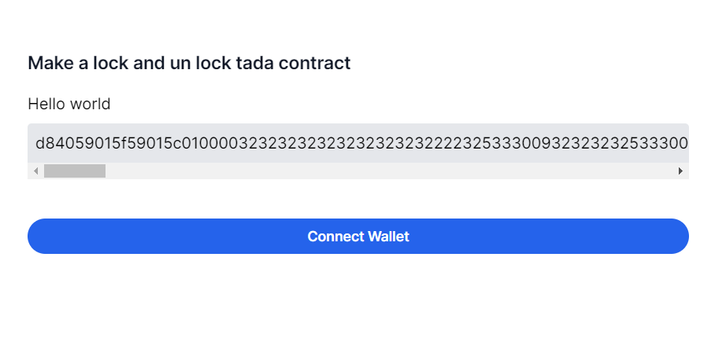
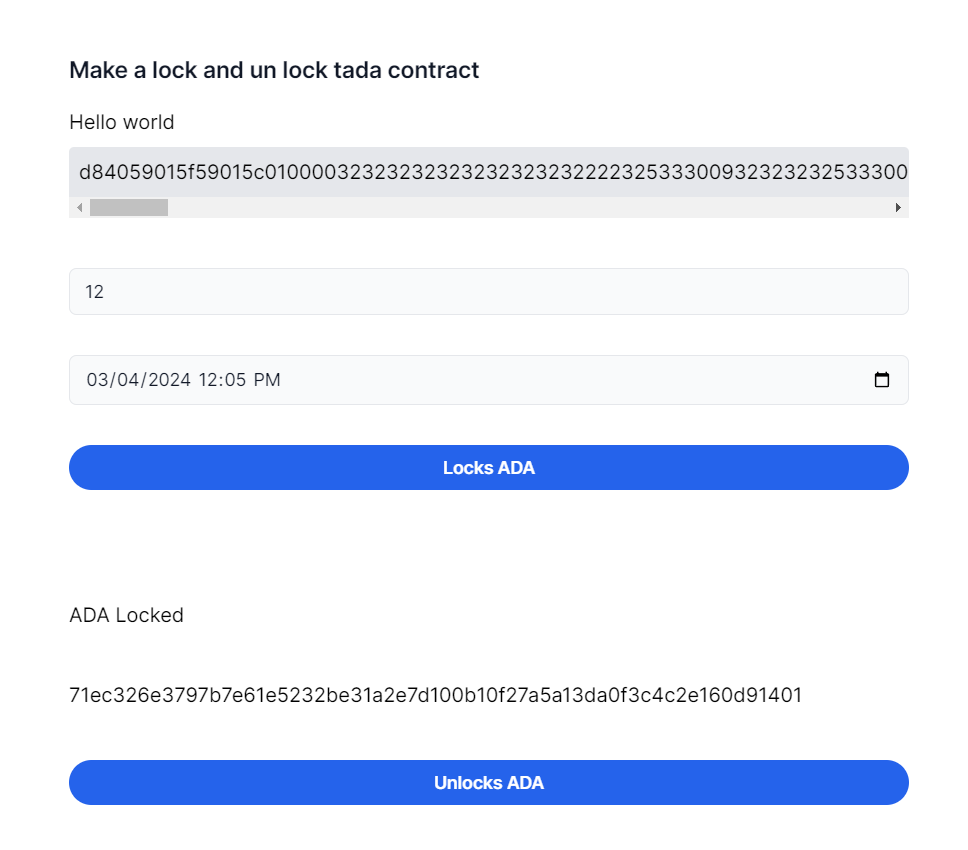
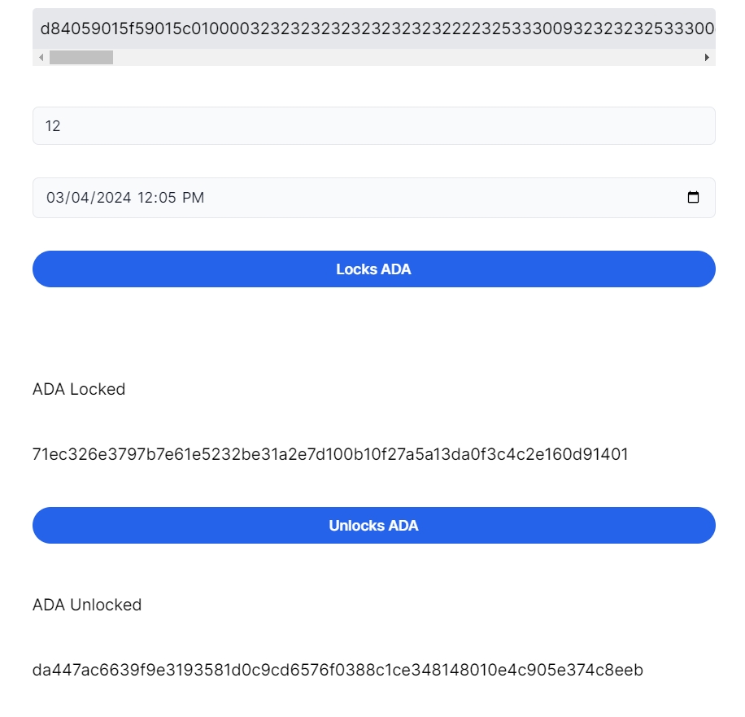

# Vesting Frontend

Trong bài học trước chúng ta cũng đã tìm hiểu và viết thành công hợp đồng Vesting và chạy chúng trên Command Line Interface. Bây giờ, nếu các bạn có một hợp đồng thông minh khá chất lượng nhưng các bạn không thể hướng dẫn người ta chạy trên câu lệnh được vì thế các bạn cần có các nút để thực hiện việc xử lý sự kiện thay vì câu lệnh. Để giải quyết vấn đề đó bài học này sẽ giúp cho các bạn tương tác thành công hợp đồng `vesting` với giao diện

### Nội dung bài học

1. Tạo một dự án nextjs cơ bản ( Trong bài học này mình sẽ sử dụng nextjs làm framework frontend chính để thực hiện tương tác với hợp đồng thông minh)
2. Thực hiện đọc các `Validator` từ file `plutus.json`
3. Định nghĩa các Datum và Redeemer ứng với hợp đồng thông minh
4. Kết nối ví thông qua Lucid và Api của Blockfrost
5. Viết các chức năng thực hiện việc Lock và UnLock tài sản

### Điều kiên tiên quyết

Để bắt đầu bài học này cần phải có nội dung cơ bản sau:

1. Môi trường phải có NodeJS.
2. Hiểu biết sơ qua về một vài thư viện frontend.
3. Hiểu các hoạt động và làm việc của hợp đông `vesting`.
4. Nắm vững các kiến thức cơ bản về Blockchain.

### 1. Tạo Dự án Nextjs

Cần phải kiểm tra xem Nodejs có trong môi trường làm việc của bạn chưa thông qua

```sh
node --version
v18.17.0
```

Nếu chưa có nodejs thì tải nodejs trên tràn chủ chính thức của nodejs song hành với nodejs là npm và npx

```sh
npm -v
9.8.1

npx -v
9.8.1
```

Trong dự án này mình thực hiện làm bằng nextjs mình sẽ sử dụng nextjs làm thư viện frontend chính để tương tác với blockchain. Để khởi tạo một dự án nextjs cần thực hiện

```sh
npx create-next-app vesting-frontend
cd vesting-frontend
npm run dev
```

sau khi khởi tạo dự án thành công lệnh `npm run dev` giúp chạy dự án trên môi trường phát triển. dự án sẽ được chạy trên PORT = 3000 như vậy việc khởi tạo dự án được thực hiện thành công.

Dự án được chạy trên PORT 3000 như vậy dự án được cài đặt thành công. Trong dự án này còn có hai thư viện quan trong khác cần phải được cài đặt đó là `lucid-cardano` và `cbor-x`. Hai thư viện này chịu trách nhiệm chính trong việc tương tác với hợp đồng thông minh. Khi đã cài đặt thành công hay bắt đầu một bài học thú vị hơn.

```sh
npm install lucid-cardano cbor-x
```

### 2. Thực hiện đọc các Validator từ file plutus.json

Trong thư mục src của dự án nextjs thực hiện tạo một thu mục có lên là libs. Thư mục này chuyên để các validator của dự án các validator được sinh ra trong quá trình thực hiện build smartcontract khi đã thực hiện thành công bây giờ chúng ta cùng thực hiện đọc validator để sử dụng cho hợp đồng thông minh.

```ts
import { SpendingValidator, fromHex, toHex } from "lucid-cardano";
import { encode } from "cbor-x";
import vesting from "~/libs/plutus.json";

const readValidator = function (): SpendingValidator {
    // Tìm kiểm xem có validator trong file plutus.json không ???
    const vestingValidator = vesting.validators.find(function (validator) {
        return validator.title === "contract.vesting";
    });

    // Kiểm tra validator trong plutus.json
    if (!vestingValidator) {
        throw new Error("Vesting validator not found.");
    }

    // Thực hiện encode validator theo mã chuẩn của cbor-x
    const vestingScript: string = toHex(
        encode(fromHex(vestingValidator.compiledCode))
    );

    // Trả về validator theo plutusV2
    return {
        type: "PlutusV2",
        script: vestingScript,
    };
};

export default readValidator;
```

Trong đây, Hàm đọc `validator` thực chất thực hiện đọc trình xác thực từ bản thiết kế (`plutus.json`) mà chúng ta đã tạo trước đó. Chúng tôi cũng cần chuyển đổi nó sang định dạng mà `Lucid` có thể hiểu được. Điều này được thực hiện bằng cách tuần tự hóa trình xác nhận và sau đó chuyển đổi nó thành chuỗi văn bản thập lục phân.

### 3. Định nghĩa datum và redeemer theo hợp đồng thông minh.

Thực hiện tạo folder `constants` trong thư mục `src` sau đó thực hiện tạo các file `datum.ts` và `redeemer.ts` với mục đích xây dựng ra các điều kiện đầu vào cho hợp đồng thông minh. Định nghĩa các `Datum` ứng với các giá trị mà chúng ta đã định nghĩa `Datum` trong hợp đồng và khi đưa vào Lucid nó có thể hiểu được. Định nghĩa một `Datum` `Owner Beneficiary` có kiểu dữ liệu là `ByteArray` map với kiểu `String`, `LockUntil` là khoảng thời gian có thể lấy tải sản ra khỏi hợp đồng.và thực hiện `export` để sử dụng cho các điều kiên giao dịch. `Datum` là một phần thông tin có thể được liên kết với `UTXO` và được sử dụng để mang thông tin trạng thái tập lệnh như chủ sở hữu của nó hoặc chi tiết thời gian

```ts
import { Data } from "lucid-cardano";

const VestingDatumSchema = Data.Object({
    lock_until: Data.Integer(),
    owner: Data.Bytes(),
    beneficiary: Data.Bytes(),
});

type VestingDatum = Data.Static<typeof VestingDatumSchema>;
export const VestingDatum = VestingDatumSchema as unknown as VestingDatum;
```

Trong hợp đồng thông minh Vesting datum có giá trị là kiểu Void bên mình sẽ định nghĩa redeemer theo `Data.void()`

```ts
import { Data } from "lucid-cardano";
export const redeemer = Data.void();
```

### 4. Tạo một giao diện cơ bản

Trong hướng dẫn này sẽ giúp tạo một giao diện cơ bản bằng sử dụng `tailwindcss` để thực hiện render ra `validator` từ `read-validator.ts` đã tạo

```tsx
import React from "react";
import readValidator from "~/utils/read-validators";
import HelloWorld from "~/components/HelloWorld";
export default function Home() {
    const validators = readValidator(); // Đọc validator từ hợp đồng
    return (
        <main>
            <div className="max-w-2xl mx-auto mt-20 mb-10">
                <div className="mb-10">
                    <h2 className="text-lg font-semibold text-gray-900">
                        Make a lock and un lock tada contract
                    </h2>

                    <h3 className="mt-4 mb-2">Hello world</h3>
                    <div className="bg-gray-200 p-2 rounded overflow-x-scroll">
                        {validators.script} {/*Render validator*/}
                    </div>
                </div>
            </div>
        </main>
    );
}
```

Giao diện được hiển thị như sau:



### 4. Kết nối ví thông qua Lucid và Api của Blockfrost

Trong dự án này mình sẽ dùng lucid làm công cụ để kết nối ví trong này mình sẽ sử dụng nami làm ví chính đê thực hiện tương tác với Blockchain. Trước tiên mình cần tạo folder contexts trong thư mục src sau đó tạo các context tương ứng để thực hiện với nhiều mục đích khác nhau đồng thời dễ quản lý trang web hơn về mặt toàn cục.

```ts
"use client";

import React, { ReactNode, useContext, useState } from "react";
import { Blockfrost, Lucid } from "lucid-cardano";
import WalletContext from "~/contexts/components/WalletContext";
import LucidContext from "~/contexts/components/LucidContext";
import { LucidContextType } from "~/types/contexts/LucidContextType";

type Props = {
    children: ReactNode;
};

const WalletProvider = function ({ children }: Props) {
    const { setLucid } = useContext<LucidContextType>(LucidContext);

    const connect = async function () {
        try {
            const lucid: Lucid = await Lucid.new(
                new Blockfrost(
                    process.env.BLOCKFROST_PROPROD_RPC_URL as string,
                    process.env.BLOCKFROST_PROPROD_API as string
                ),
                "Preprod"
            );
            lucid.selectWallet(await window.cardano.nami.enable());
            setLucid(lucid);
        } catch (error) {
            console.log(error);
        }
    };

    const disconnect = async function () {
        try {
            setLucid(null!);
        } catch (error) {
            console.log(error);
        }
    };

    return (
        <WalletContext.Provider
            value={{
                connect,
                disconnect,
            }}
        >
            {children}
        </WalletContext.Provider>
    );
};

export default WalletProvider;
```

Bây giờ, chúng ta có thể hướng tới vòi Cardano để nhận một số tiền trên mạng xem trước tới địa chỉ mới được tạo của chúng tôi (bên trong me.addr).


Đảm bảo chọn "Preview Testnet" làm mạng. Thực hiên copy địa chỉ mà đã sinh ra từ trước và paste vào để nhận một số đồng tiền test. Sử dụng `CardanoScan` chúng ta có thể theo dõi vòi gửi một số ADA theo cách của chúng ta. Quá trình này sẽ khá nhanh (vài giây). Bây giờ chúng ta đã có một số tiền, chúng ta có thể khóa chúng trong hợp đồng mới tạo của mình. Chúng tôi sẽ sử dụng `Lucid` để xây dựng và gửi giao dịch của chúng tôi thông qua `Block Frost`. Đây chỉ là một ví dụ về khả năng thiết lập bằng các công cụ mà chúng tôi yêu thích. Để biết thêm công cụ, hãy nhớ xem Cổng thông tin dành cho nhà phát triển Cardano! Đầu tiên, chúng tôi thiết lập Lucid với `Block Frost` làm nhà cung cấp. Điều này sẽ cho phép chúng tôi để `Lucid` xử lý việc xây dựng giao dịch cho chúng tôi, bao gồm cả việc quản lý các thay đổi. Nó cũng cung cấp cho chúng tôi một cách trực tiếp để gửi giao dịch sau này.

Lưu ý rằng dòng được đánh dấu ở trên sẽ tìm kiếm một biến môi trường có tên `BLOCKFROST_PROJECT_ID` mà giá trị của nó phải được đặt thành id dự án `Block Frost` của bạn. Bạn có thể xác định một biến môi trường mới trong thiết bị đầu cuối của mình bằng cách chạy (trong cùng phiên bạn cũng đang thực thi tập lệnh):

```sh
export BLOCKFROST_PROJECT_ID=preprody7qLCi4kIiAUEFRlJvmZ2PTi6jreF7gI
```


Bây giờ hãy tạo một folder `components` sau đó thực hiện hiết `HelloWorld.ts` Đây chính là nơi để thực hiện tương tác trực tiếp với họp đồng thông minh thông qua giao diện.

### 5. Viết các chức năng thực hiện việc Lock và UnLock tài sản

Để thực hiện lock tài sản và blockchain mình sẽ thực hiện tạo ra các ràng buộc với hợp đồng thông minh bằng việc sử dụng các datum và redeemer như trước để ép các điều kiện vào đủ cho việc thục hiện giao dịch `lockUntil` trong đây được sử dụng làm điều kiện chỉ mốc thời gian tài sản sẽ được unlock khỏi hợp đông thông minh đồng thời sẽ thực hiện đọc các validator đã được xây dụng từ trước đồng thời biên dịch ra địa chỉ của hợp đồng thông minh sau đó sẽ soạn một giao dịch với các điều kiến được định nghĩa từ trước cùng với một và ada chúng ta sẽ kí và được rồi giao dịch đã thành công.

```ts
import { Data, Lucid, TxComplete, TxHash, TxSigned } from "lucid-cardano";
import { VestingDatum } from "~/constants/datum";
import readValidator from "~/utils/read-validator";

type Props = {
    lucid: Lucid;
    lockUntil: bigint;
    lovelace: bigint;
};

const vestingLock = async function ({
    lucid,
    lockUntil,
    lovelace,
}: Props): Promise<TxHash> {
    const ownerPublicKeyHash: string = lucid.utils.getAddressDetails(
        await lucid.wallet.address()
    ).paymentCredential?.hash as string;

    const beneficiaryPublicKeyHash: string = lucid.utils.getAddressDetails(
        await lucid.wallet.address()
    ).paymentCredential?.hash as string;

    const datum = Data.to(
        {
            beneficiary: beneficiaryPublicKeyHash,
            owner: ownerPublicKeyHash,
            lock_until: lockUntil,
        },
        VestingDatum
    );

    const validator = readValidator();
    const contractAddress: string = lucid.utils.validatorToAddress(validator);
    const tx: TxComplete = await lucid
        .newTx()
        .payToContract(
            contractAddress,
            { inline: datum },
            { lovelace: lovelace }
        )
        .complete();

    const signedTx: TxSigned = await tx.sign().complete();
    const txHash: TxHash = await signedTx.submit();
    lucid.awaitTx(txHash);

    console.log(txHash);
    return txHash;
};

export default vestingLock;
```

sau khi viết xong hàm `lock` thì chúng ta cần thực thi hàm đó bằng cách viết trực tiếp vào trong component mà chúng ta tương tác

```ts
"use client";

import { Blockfrost, Constr, Data, Lucid, fromText } from "lucid-cardano";
import React, {
    ChangeEvent,
    useEffect,
    useState,
    lazy,
    useContext,
} from "react";

import Link from "next/link";
import { SmartContractContextType } from "~/types/contexts/SmartContractContextType";
import SmartContractContext from "~/contexts/components/SmartContractContext";
import { LucidContextType } from "~/types/contexts/LucidContextType";
import LucidContext from "~/contexts/components/LucidContext";
import { WalletContextType } from "~/types/contexts/WalletContextType";
import WalletContext from "~/contexts/components/WalletContext";

type Props = {};

const HelloWorld = function ({}: Props) {
    const {
        tADA,
        setTADA,
        lockUntil,
        setLockUntil,
        lockVesting,
        unLockVesting,
        lockTxHash,
        unlockTxHash,
        waitingLockTx,
        waitingUnlockTx,
    } = useContext<SmartContractContextType>(SmartContractContext);
    const { lucid } = useContext<LucidContextType>(LucidContext);
    const { connect } = useContext<WalletContextType>(WalletContext);

    return (
        <div>
            {!lucid && (
                <div className="mt-10 grid grid-cols-1 gap-y-8">
                    <button
                        className="group inline-flex items-center justify-center rounded-full py-2 px-4 text-sm font-semibold focus:outline-none bg-blue-600 text-white hover:bg-blue-500 active:bg-blue-800 active:text-blue-100"
                        onClick={connect}
                    >
                        Connect Wallet
                    </button>
                </div>
            )}

            {lucid && (
                <div>
                    <div className="mt-10 grid grid-cols-1 gap-y-8">
                        <input
                            type="text"
                            name="giftADA"
                            id="giftADA"
                            value={tADA}
                            className="block w-full appearance-none rounded-md border border-gray-200 bg-gray-50 px-3 py-2 text-gray-900 placeholder-gray-400 focus:border-blue-500 focus:bg-white focus:outline-none focus:ring-blue-500 sm:text-sm"
                            onChange={(e) => setTADA(e.target.value)}
                        />
                        <input
                            type="datetime-local"
                            value={lockUntil}
                            className="block w-full appearance-none rounded-md border border-gray-200 bg-gray-50 px-3 py-2 text-gray-900 placeholder-gray-400 focus:border-blue-500 focus:bg-white focus:outline-none focus:ring-blue-500 sm:text-sm"
                            onChange={(e) => setLockUntil(e.target.value)}
                        />

                        <button
                            className="group inline-flex items-center justify-center rounded-full py-2 px-4 text-sm font-semibold focus:outline-none bg-blue-600 text-white hover:bg-blue-500 active:bg-blue-800 active:text-blue-100"
                            onClick={() => lockVesting({ lucid })}
                            disabled={waitingLockTx || !!lockTxHash}
                        >
                            {waitingLockTx ? "Waiting for Tx..." : "Locks ADA"}
                        </button>

                        {lockTxHash && (
                            <div className="mt-10 grid grid-cols-1 gap-y-8">
                                <h3 className="mt-4 mb-2">ADA Locked</h3>
                                <Link
                                    className="mb-2"
                                    target="_blank"
                                    href={`https://preprod.cardanoscan.io/transaction/${lockTxHash}`}
                                >
                                    {lockTxHash}
                                </Link>
                                <button
                                    className="group inline-flex items-center justify-center rounded-full py-2 px-4 text-sm font-semibold focus:outline-none bg-blue-600 text-white hover:bg-blue-500 active:bg-blue-800 active:text-blue-100"
                                    onClick={() => unLockVesting({ lucid })}
                                    disabled={waitingLockTx || !!unlockTxHash}
                                >
                                    {waitingUnlockTx
                                        ? "Waiting for Tx..."
                                        : "Unlocks ADA"}
                                </button>
                            </div>
                        )}
                        {unlockTxHash && (
                            <>
                                <h3 className="mt-4 mb-2">ADA Unlocked</h3>
                                <Link
                                    className="mb-2"
                                    target="_blank"
                                    href={`https://preprod.cardanoscan.io/transaction/${unlockTxHash}`}
                                >
                                    {unlockTxHash}
                                </Link>
                            </>
                        )}
                    </div>
                </div>
            )}
        </div>
    );
};

export default HelloWorld;
```

Trước tiên hay thực hiện các chức năng kết nối ví. Trong đây mình sẽ sử dụng `Nami` là ví chính để thực hiện tương tác với cardano.

Sau khi quá trình Lock tài sản được thực hiện thành công thì chúng ta sẽ lấy lại tài sản mà đã bị lock và hợp đông thông minh bằng việc viết hàm un lock.

Khi nếu nối ví thành công tiếp theo cần thực hiện một vài thao tác để tương tác với hợp đông thông minh. Trước tiên là Lock tài sản. Bây giờ chúng ta có thể đọc trình xác thực của mình, chúng ta có thể thực hiện giao dịch đầu tiên để khóa tiền vào hợp đồng. Số liệu phải khớp với biểu diễn mà trình xác thực mong đợi (và như được chỉ định trong bản thiết kế), vì vậy đây là hàm tạo với một trường duy nhất là một mảng byte.

Chúng ta kết nối ví và thực hiện Lock 1 ADA vào hợp đồng khi đó giao diện sẽ có dạng như sau



Khi giao dịch thực hiện thành công transaction hash được in lên màn hình khi đó có thể kiếm tra giao dịch bằng cách click và transaction hash đó để sang cardano scan để kiểm tra.


Như vậy quá trình lock tài sản được thực hiện thành công.

### 6. Thực hiện Un Lock tài sản khỏi hợp đồng thông minh

```ts
import { Data, Lucid, TxComplete, TxHash, TxSigned, UTxO } from "lucid-cardano";
import readValidator from "~/utils/read-validator";
import { VestingDatum } from "~/constants/datum";
import { redeemer } from "~/constants/redeemer";

type Props = {
    lucid: Lucid;
};

const vestingUnLock = async function ({ lucid }: Props): Promise<TxHash> {
    const beneficiaryPublicKeyHash = lucid.utils.getAddressDetails(
        await lucid.wallet.address()
    ).paymentCredential?.hash as string;

    const validator = readValidator();
    const contractAddress = lucid.utils.validatorToAddress(validator);
    const scriptUtxos = await lucid.utxosAt(contractAddress);
    const currentTime = new Date().getTime();
    const laterTime = new Date(currentTime + 2 * 60 * 60 * 1000).getTime();

    const utxos: UTxO[] = scriptUtxos.filter(function (utxo) {
        let datum = Data.from(utxo.datum!, VestingDatum);

        return (
            datum.beneficiary === beneficiaryPublicKeyHash &&
            datum.lock_until <= currentTime
        );
    });

    const tx: TxComplete = await lucid
        .newTx()
        .collectFrom(utxos, redeemer)
        .addSigner(await lucid.wallet.address())
        .validFrom(currentTime)
        .validTo(laterTime)
        .attachSpendingValidator(validator)
        .complete();

    const signedTx: TxSigned = await tx.sign().complete();

    const txHash: TxHash = await signedTx.submit();

    await lucid.awaitTx(txHash);
    return txHash;
};

export default vestingUnLock;
```

cũng như vậy hãy thêm chức năng vào components để thực hiện tương tác với hợp đồng thông minh

```tsx
"use client";

import { Blockfrost, Constr, Data, Lucid, fromText } from "lucid-cardano";
import React, {
    ChangeEvent,
    useEffect,
    useState,
    lazy,
    useContext,
} from "react";

import Link from "next/link";
import { SmartContractContextType } from "~/types/contexts/SmartContractContextType";
import SmartContractContext from "~/contexts/components/SmartContractContext";
import { LucidContextType } from "~/types/contexts/LucidContextType";
import LucidContext from "~/contexts/components/LucidContext";
import { WalletContextType } from "~/types/contexts/WalletContextType";
import WalletContext from "~/contexts/components/WalletContext";

type Props = {};

const HelloWorld = function ({}: Props) {
    const {
        tADA,
        setTADA,
        lockUntil,
        setLockUntil,
        lockVesting,
        unLockVesting,
        lockTxHash,
        unlockTxHash,
        waitingLockTx,
        waitingUnlockTx,
    } = useContext<SmartContractContextType>(SmartContractContext);
    const { lucid } = useContext<LucidContextType>(LucidContext);
    const { connect } = useContext<WalletContextType>(WalletContext);

    return (
        <div>
            {!lucid && (
                <div className="mt-10 grid grid-cols-1 gap-y-8">
                    <button
                        className="group inline-flex items-center justify-center rounded-full py-2 px-4 text-sm font-semibold focus:outline-none bg-blue-600 text-white hover:bg-blue-500 active:bg-blue-800 active:text-blue-100"
                        onClick={connect}
                    >
                        Connect Wallet
                    </button>
                </div>
            )}

            {lucid && (
                <div>
                    <div className="mt-10 grid grid-cols-1 gap-y-8">
                        <input
                            type="text"
                            name="giftADA"
                            id="giftADA"
                            value={tADA}
                            className="block w-full appearance-none rounded-md border border-gray-200 bg-gray-50 px-3 py-2 text-gray-900 placeholder-gray-400 focus:border-blue-500 focus:bg-white focus:outline-none focus:ring-blue-500 sm:text-sm"
                            onChange={(e) => setTADA(e.target.value)}
                        />
                        <input
                            type="datetime-local"
                            value={lockUntil}
                            className="block w-full appearance-none rounded-md border border-gray-200 bg-gray-50 px-3 py-2 text-gray-900 placeholder-gray-400 focus:border-blue-500 focus:bg-white focus:outline-none focus:ring-blue-500 sm:text-sm"
                            onChange={(e) => setLockUntil(e.target.value)}
                        />

                        <button
                            className="group inline-flex items-center justify-center rounded-full py-2 px-4 text-sm font-semibold focus:outline-none bg-blue-600 text-white hover:bg-blue-500 active:bg-blue-800 active:text-blue-100"
                            onClick={() => lockVesting({ lucid })}
                            disabled={waitingLockTx || !!lockTxHash}
                        >
                            {waitingLockTx ? "Waiting for Tx..." : "Locks ADA"}
                        </button>

                        {lockTxHash && (
                            <div className="mt-10 grid grid-cols-1 gap-y-8">
                                <h3 className="mt-4 mb-2">ADA Locked</h3>
                                <Link
                                    className="mb-2"
                                    target="_blank"
                                    href={`https://preprod.cardanoscan.io/transaction/${lockTxHash}`}
                                >
                                    {lockTxHash}
                                </Link>
                                <button
                                    className="group inline-flex items-center justify-center rounded-full py-2 px-4 text-sm font-semibold focus:outline-none bg-blue-600 text-white hover:bg-blue-500 active:bg-blue-800 active:text-blue-100"
                                    onClick={() => unLockVesting({ lucid })}
                                    disabled={waitingLockTx || !!unlockTxHash}
                                >
                                    {waitingUnlockTx
                                        ? "Waiting for Tx..."
                                        : "Unlocks ADA"}
                                </button>
                            </div>
                        )}
                        {unlockTxHash && (
                            <>
                                <h3 className="mt-4 mb-2">ADA Unlocked</h3>
                                <Link
                                    className="mb-2"
                                    target="_blank"
                                    href={`https://preprod.cardanoscan.io/transaction/${unlockTxHash}`}
                                >
                                    {unlockTxHash}
                                </Link>
                            </>
                        )}
                    </div>
                </div>
            )}
        </div>
    );
};

export default HelloWorld;
```




Khi thực hiện kí giao dịch thì transaction hash được in ra chứng to giao dịch thành công và chúng ta có thể check lại ví của mình xem đã nhận được đủ số ada trong tài khoản hoặc lên cardano scan để kiếm tra giao dịch.


Như vậy bài học này đã nói tổng quan qua cách triển khai việc tương tác với hợp đồng thông minh với giao diện frontend Thay vì với các dòng lên command line giúp cho việc thực hiện các chức năng được dễ dàng hơn.
