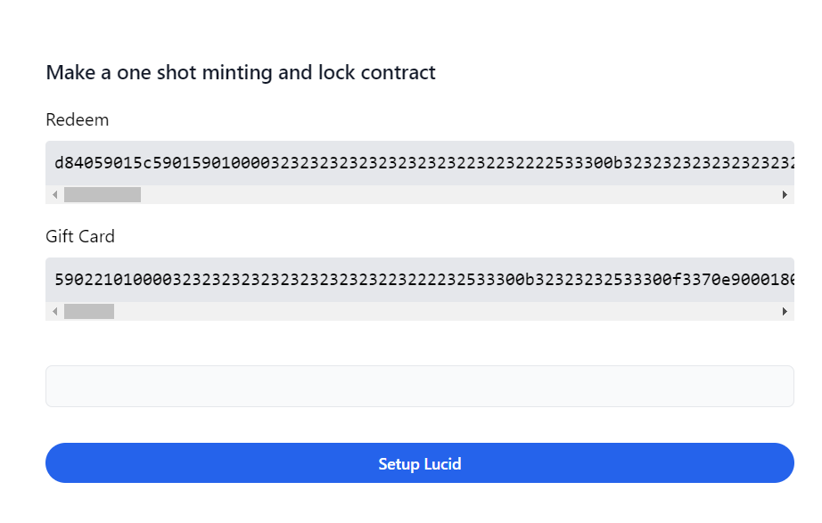

# Vesting Smartcontract Giftcard - Part 1

Với phần dễ dàng này, chúng ta có thể bắt đầu xây dựng giao diện người dùng để tương tác với các hợp đồng thông minh của mình trong trình duyệt. NextJs là một lựa chọn thú vị để xây dưng hợp đồng thông minh.

## Nội dung bài học

1. Cài đặt một dự án frontend (nextjs)
2. Cách lấy file `plutus.json` và đọc `validator` được biên dịch trong khi biên dịch hợp đồng thông minh
3. Tạo một giao diện cơ bản
4. Thực hiện kết nối ví
5. Viết các hàm Lock và Un Lock để tương tác với hợp đồng
6. Tương tác giao diện với hợp đồng thông minh

### 1. Cài đặt một dự án frontend (nextjs)

Trong dự án này chúng ta sẻ sử dụng `Nextjs` làm công cụ để xây dựng ra các tính năng tương tác với hợp đồng thông minh `hello world` để có thể sử dụng được `Nextjs` thì điểu kiên tiên quyết phải có là `Nodejs` bằng cách kiểm tra

```sh
node --version
> v18.17.0
```

`NodeJs` nên sử dụng ưu tiên từ version 16 trở nên. đồng thời với `Nodejs` là `npm` và `npx`. Được rồi để tạo dự án chúng ta cần sử dụng

```sh
npx create-next-app@latest giftcard-frontend
cd giftcard-frontend
npm run dev
```

Dự án được chạy trên PORT 3000 như vậy dự án được cài đặt thành công. Trong dự án này còn có hai thư viện quan trong khác cần phải được cài đặt đó là `lucid-cardano` và `cbor-x`. Hai thư viện này chịu trách nhiệm chính trong việc tương tác với hợp đồng thông minh. Khi đã cài đặt thành công hay bắt đầu một bài học thú vị hơn.

```sh
npm install lucid-cardano cbor-x
```

Thực hiện kiểm tra trong package.json đã xuất hiện hai gói quan trong này chưa đồng thời bài học này chúng ta sẽ sử dụng taildwindcss làm công cụ để styles.

```json
{
    // ...
    "dependencies": {
        "cbor-x": "^1.5.8",
        "lucid-cardano": "^0.10.7"
    }
    /// ...
}
```

### 2. Cách lấy file `plutus.json` và đọc `validator` được biên dịch trong khi biên dịch hợp đồng thông minh

Khi `aiken build` thì chúng ta cũng đã biên địch được hợp đồng và từ đó file `plutus.json` được tạo. Tiếp đến thực hiện việc copy file và đưa và dự án frontend bằng cách tạo thư mục `libs` trong `src`. giờ đây chỉ cần viết một hàm đọc `validator`. Hãy nhập `readValidators` tệp mới tệp của chúng tôi và sử dụng tệp đó trong trình xử lý phía máy chủ. Điều này sẽ cho phép chúng tôi truy cập dữ liệu trong `Home` thành phần trang dưới dạng đạo cụ trang mà sau đó chúng tôi sẽ sử dụng để hiển thị mã đã biên dịch của trình xác thực.

```ts
import { encode } from "cbor-x";
import {
    MintingPolicy,
    SpendingValidator,
    fromHex,
    toHex,
} from "lucid-cardano";
import giftcard from "~/libs/plutus.json";

export type Validators = {
    redeem: SpendingValidator;
    giftCard: MintingPolicy;
};

const readValidators = function (): Validators {
    const redeemValidator = giftcard.validators.find(function (validator) {
        return validator.title === "contract.redeem";
    });

    const giftCardValidator = giftcard.validators.find(function (validator) {
        return validator.title === "contract.gift_card";
    });

    if (!giftCardValidator) {
        throw new Error("Validator gift card not found.");
    }

    if (!redeemValidator) {
        throw new Error("Validator redeem not found.");
    }

    const redeemScript: string = toHex(
        encode(fromHex(redeemValidator.compiledCode))
    );
    return {
        redeem: {
            type: "PlutusV2",
            script: redeemScript,
        },
        giftCard: {
            type: "PlutusV2",
            script: giftCardValidator.compiledCode,
        },
    };
};

export default readValidators;
```

Trong đây, Hàm đọc `validator` thực chất thực hiện đọc trình xác thực từ bản thiết kế (`plutus.json`) mà chúng ta đã tạo trước đó. Chúng tôi cũng cần chuyển đổi nó sang định dạng mà `Lucid` có thể hiểu được. Điều này được thực hiện bằng cách tuần tự hóa trình xác nhận và sau đó chuyển đổi nó thành chuỗi văn bản thập lục phân.

Không có gì đặc biệt ở đây cả. Chúng tôi chỉ đọc `plutus.json` tệp và tìm mã được biên dịch cho trình xác nhận `redeem` và `gift_card`. Chúng tôi cũng đang xuất một loại cho trình xác nhận để chúng tôi có thể sử dụng nó trên đảo của mình sau này. Việc chức năng này có khả năng gây ra lỗi chỉ là một cách để báo hiệu cho chúng ta biết rằng chúng ta đã làm sai điều gì đó.

### 3. Tạo một giao diện cơ bản

Dưới đây chúng tôi sẽ thực hiện tạo một giao diện cơ bản theo cách của chúng tôi trước hết sẽ thực hiện in validator vừa tạo nên màn hình để kiếm tra thực sự validator đã được tạo hay chưa.

```ts
import React, { lazy } from "react";
import readValidators from "~/utils/read-validators";

const Oneshot = lazy(() => import("~/components/Oneshot"));

type Props = {};

const Home = function ({}: Props) {
    const validators = readValidators();
    return (
        <main>
            <div className="max-w-2xl mx-auto mt-20 mb-10">
                <div className="mb-10">
                    <h2 className="text-lg font-semibold text-gray-900">
                        Make a one shot minting and lock contract
                    </h2>

                    <h3 className="mt-4 mb-2">Redeem</h3>
                    <pre className="bg-gray-200 p-2 rounded overflow-x-scroll">
                        {validators.redeem.script}
                    </pre>

                    <h3 className="mt-4 mb-2">Gift Card</h3>
                    <pre className="bg-gray-200 p-2 rounded overflow-x-scroll">
                        {validators.giftCard.script}
                    </pre>
                </div>
                <Oneshot />
            </div>
        </main>
    );
};

export default Home;
```

Từ hàm `readValidators` mà chúng ta viết sẽ hiển thị lên trên màn hình nếu validator được đọc thành công để. Giao diện được hiển thị như sau:



### 5. Thực hiện kết nối ví

Thực hiện tạo folder `contexts` trong thư mục `src` sau đó viết các chức năng connect wallet và disconnect wallet thông qua Lucid và Api của blockfrost

```tsx
"use client";

import React, { ReactNode, useContext, useState } from "react";
import { Blockfrost, Lucid } from "lucid-cardano";
import WalletContext from "~/contexts/components/WalletContext";
import LucidContext from "~/contexts/components/LucidContext";
import { LucidContextType } from "~/types/contexts/LucidContextType";

type Props = {
    children: ReactNode;
};

const WalletProvider = function ({ children }: Props) {
    const { setLucid } = useContext<LucidContextType>(LucidContext);

    // Chức năng thực hiện connect ví
    const connect = async function () {
        try {
            const lucid: Lucid = await Lucid.new(
                new Blockfrost(
                    process.env.BLOCKFROST_PROPROD_RPC_URL as string,
                    process.env.BLOCKFROST_PROPROD_API as string
                ),
                "Preprod"
            );

            // chọn ví Nami để tương tác với hợp đồng thông minh thông thông qua lucid và api blockfrost
            lucid.selectWallet(await window.cardano.nami.enable());
            setLucid(lucid);
        } catch (error) {
            console.log(error);
        }
    };

    const disconnect = async function () {
        try {
            setLucid(null!);
        } catch (error) {
            console.log(error);
        }
    };

    return (
        <WalletContext.Provider
            value={{
                connect,
                disconnect,
            }}
        >
            {children}
        </WalletContext.Provider>
    );
};

export default WalletProvider;
```

Bây giờ, chúng ta có thể hướng tới vòi Cardano để nhận một số tiền trên mạng xem trước tới địa chỉ mới được tạo của chúng tôi (bên trong me.addr).


Đảm bảo chọn "Preview Testnet" làm mạng. Thực hiên copy địa chỉ mà đã sinh ra từ trước và paste vào để nhận một số đồng tiền test. Sử dụng `CardanoScan` chúng ta có thể theo dõi vòi gửi một số ADA theo cách của chúng ta. Quá trình này sẽ khá nhanh (vài giây). Bây giờ chúng ta đã có một số tiền, chúng ta có thể khóa chúng trong hợp đồng mới tạo của mình. Chúng tôi sẽ sử dụng `Lucid` để xây dựng và gửi giao dịch của chúng tôi thông qua `Block Frost`. Đây chỉ là một ví dụ về khả năng thiết lập bằng các công cụ mà chúng tôi yêu thích. Để biết thêm công cụ, hãy nhớ xem Cổng thông tin dành cho nhà phát triển Cardano! Đầu tiên, chúng tôi thiết lập Lucid với `Block Frost` làm nhà cung cấp. Điều này sẽ cho phép chúng tôi để `Lucid` xử lý việc xây dựng giao dịch cho chúng tôi, bao gồm cả việc quản lý các thay đổi. Nó cũng cung cấp cho chúng tôi một cách trực tiếp để gửi giao dịch sau này.

Lưu ý rằng dòng được đánh dấu ở trên sẽ tìm kiếm một biến môi trường có tên `BLOCKFROST_PROJECT_ID` mà giá trị của nó phải được đặt thành id dự án `Block Frost` của bạn. Bạn có thể xác định một biến môi trường mới trong thiết bị đầu cuối của mình bằng cách chạy (trong cùng phiên bạn cũng đang thực thi tập lệnh):

```sh
export BLOCKFROST_PROJECT_ID=preprody7qLCi4kIiAUEFRlJvmZ2PTi6jreF7gI
```


Bây giờ hãy tạo một folder `components` sau đó thực hiện hiết `HelloWorld.ts` Đây chính là nơi để thực hiện tương tác trực tiếp với họp đồng thông minh thông qua giao diện.

```tsx
"use client";

import { Blockfrost, Constr, Data, Lucid, fromText } from "lucid-cardano";
import React, {
    ChangeEvent,
    useEffect,
    useState,
    lazy,
    useContext,
} from "react";

import Link from "next/link";
import { SmartContractContextType } from "~/types/contexts/SmartContractContextType";
import SmartContractContext from "~/contexts/components/SmartContractContext";
import { LucidContextType } from "~/types/contexts/LucidContextType";
import LucidContext from "~/contexts/components/LucidContext";
import { WalletContextType } from "~/types/contexts/WalletContextType";
import WalletContext from "~/contexts/components/WalletContext";

type Props = {};

const HelloWorld = function ({}: Props) {
    const {
        tADA,
        setTADA,
        lockHelloworld,
        unLockHelloword,
        lockTxHash,
        unlockTxHash,
        waitingLockTx,
        waitingUnlockTx,
    } = useContext<SmartContractContextType>(SmartContractContext);
    const { lucid } = useContext<LucidContextType>(LucidContext);
    const { connect } = useContext<WalletContextType>(WalletContext);

    return (
        <div>
            {!lucid && (
                <div className="mt-10 grid grid-cols-1 gap-y-8">
                    <button
                        className="group inline-flex items-center justify-center rounded-full py-2 px-4 text-sm font-semibold focus:outline-none bg-blue-600 text-white hover:bg-blue-500 active:bg-blue-800 active:text-blue-100"
                        onClick={connect}
                    >
                        Connect Wallet
                    </button>
                </div>
            )}
        </div>
    );
};

export default HelloWorld;
```

Trước tiên hay thực hiện các chức năng kết nối ví. Trong đây mình sẽ sử dụng `Nami` là ví chính để thực hiện tương tác với cardano.
