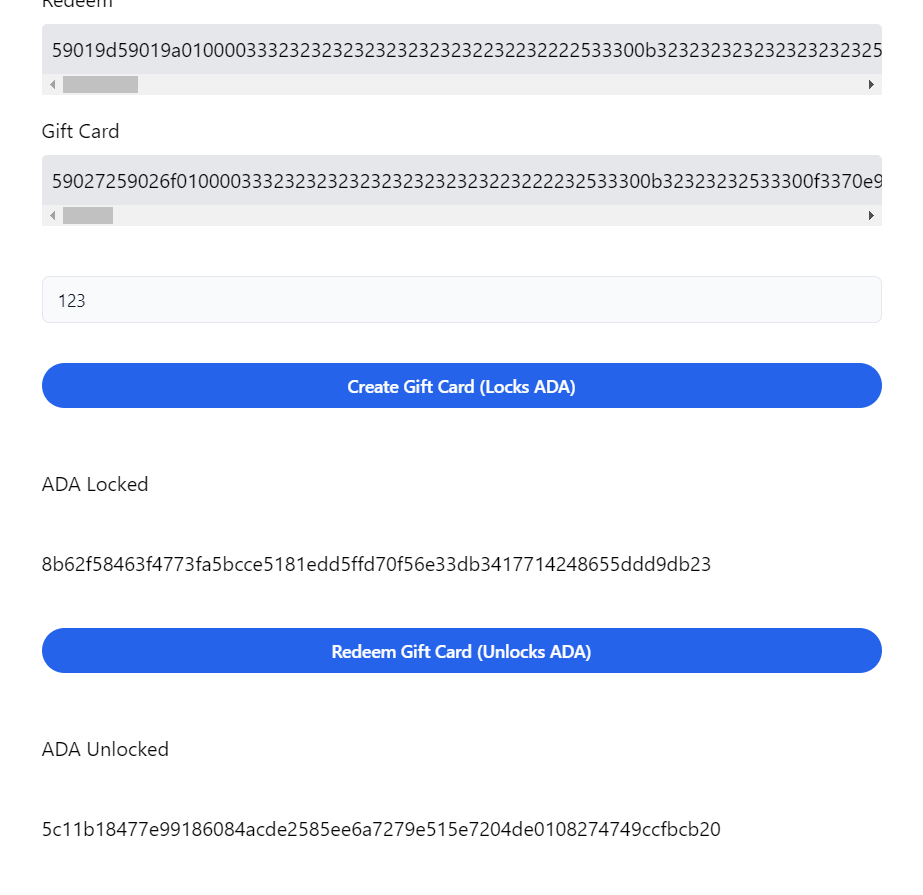
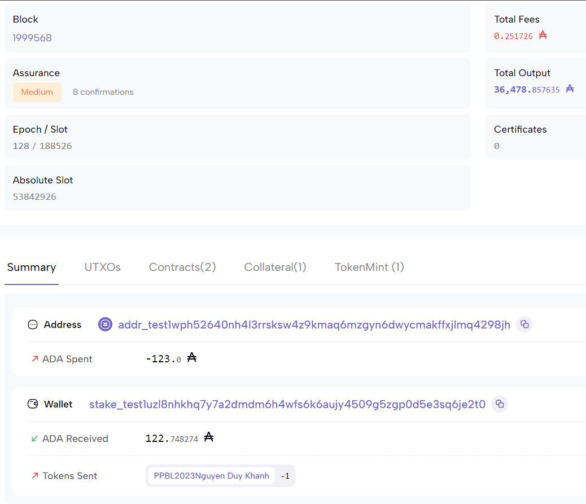

# Vesting Smartcontract Giftcard - Part 2

Bây giờ chúng ta có thể bắt đầu xây dựng giao diện người dùng để tương tác với các hợp đồng thông minh của mình trong trình duyệt. Deno Fresh là một dự án thú vị để xây dựng các ứng dụng web trong Deno. Đây là một lựa chọn tuyệt vời để tạo ra các ứng dụng web hiện đại mà không cần phải sử dụng Node.js hoặc các công nghệ khác. Bạn có thể bắt đầu bằng cách tạo một dự án mới với Deno Fresh và sau đó bắt đầu phát triển giao diện người dùng của bạn từ đó. Điều này bao gồm việc xây dựng các trang web tương tác, kết nối với các hợp đồng thông minh của bạn và hiển thị dữ liệu một cách đáng tin cậy cho người dùng. Hãy tiếp tục nỗ lực và chúc bạn thành công trong việc xây dựng giao diện người dùng cho các hợp đồng thông minh của mình!

### Nội dung bài học

1. Tạo một dự án (Sử dụng Deno làm công cụ chính)

-   Khởi tạo một dự án mới với Deno Fresh
-   Cấu hình cơ bản cho dự án Deno

2. Xây dựng giao diện tương tác với `gift card`

-   Thiết kế giao diện người dùng cho ứng dụng gift card
-   Tạo các trang và thành phần UI cần thiết bằng HTML, CSS và Typescript
-   Đảm bảo giao diện người dùng thân thiện và dễ sử dụng

3. Viết các chức năng tương tác với hợp đồng

-   Sử dụng Typescript để kết nối và tương tác với các hợp đồng thông minh trên blockchain
-   Xây dựng các chức năng cho phép người dùng gửi và rút tiền từ hợp đồng
-   Xử lý các sự kiện và giao tiếp với hợp đồng thông minh một cách an toàn và hiệu quả

Hãy tiếp tục theo dõi các bước trong nội dung bài học này để xây dựng một ứng dụng tương tác hoàn chỉnh với hợp đồng thông minh trên blockchain sử dụng Deno.

### 1. Tạo một dự án (Sử dụng deno làm công cụ chính)

Hãy tạo một dự án mới Deno trong cùng thư mục với dự án Aiken của chúng tôi. Khi được nhắc bật CSS Tailwind

```sh
deno run -A -r https://fresh.deno.dev .
```

Đối với sự rõ ràng, chúng ta nên thêm một bí danh để hàng nhập vào trông đẹp hơn. Hãy chỉnh sửa import_map.json như sau:

```json
{
    "imports": {
        "$fresh/": "...",
        "preact": "...",
        "preact/": "...",
        "preact-render-to-string": "...",
        "@preact/signals": "...",
        "@preact/signals-core": "...",
        "twind": "...",
        "twind/": "...",
        "lucid/": "https://deno.land/x/lucid@0.9.5/",
        "~/": "./"
    }
}
```

Bằng cách này, chúng ta đã thêm bí danh cho các module và hàng nhập vào, làm cho mã của chúng ta trở nên rõ ràng và dễ đọc hơn. Tiếp theo, bạn có thể tiếp tục xây dựng ứng dụng của mình trong Deno với CSS Tailwind.

Dưới đây là cách xóa một số thành phần không cần thiết từ dự án mẫu và thêm một thành phần nút có thể tái sử dụng:

```sh
rm islands/Counter.tsx
rm -rf routes/api
rm routes/\[name\].tsx
```

Sau đó, bạn có thể thêm mã sau vào dự án của mình, để tạo một thành phần nút có thể tái sử dụng:

```ts
import { JSX } from "preact";
import { IS_BROWSER } from "$fresh/runtime.ts";

export function Button(props: JSX.HTMLAttributes<HTMLButtonElement>) {
    return (
        <button
            {...props}
            disabled={!IS_BROWSER || props.disabled}
            class={`group inline-flex items-center justify-center rounded-full py-2 px-4 text-sm font-semibold focus:outline-none bg-blue-600 text-white hover:bg-blue-500 active:bg-blue-800 active:text-blue-100 ${props.class}`}
        />
    );
}
```

Mã trên định nghĩa một thành phần Button dựa trên thẻ <button> trong HTML, với các thuộc tính được chuyển vào qua props. Nó cũng kiểm tra xem liệu ứng dụng đang chạy trên trình duyệt hay không (IS_BROWSER), và nếu không, nút sẽ bị vô hiệu hóa.
Sau khi thêm mã này vào dự án Deno của bạn, bạn sẽ có một thành phần nút có thể tái sử dụng và một thành phần input mới như sau:

```ts
import { ComponentChild, JSX } from "preact";

export function Input({
    children,
    id,
    ...props
}: JSX.HTMLAttributes<HTMLInputElement>) {
    return (
        <div>
            <label
                for={id}
                class="block mb-3 text-sm font-medium text-gray-700"
            >
                {children}
            </label>
            <input
                {...props}
                id={id}
                class="block w-full appearance-none rounded-md border border-gray-200 bg-gray-50 px-3 py-2 text-gray-900 placeholder-gray-400 focus:border-blue-500 focus:bg-white focus:outline-none focus:ring-blue-500 sm:text-sm"
            />
        </div>
    );
}
```

Thành phần Input này cho phép bạn tạo ra các ô nhập dữ liệu trong ứng dụng của mình. Nó bao gồm một nhãn và một ô nhập dữ liệu với các lớp CSS Tailwind được áp dụng để tạo ra giao diện người dùng thân thiện và dễ sử dụng. Bạn có thể sử dụng Input trong ứng dụng của mình bằng cách gọi nó và truyền các thuộc tính cần thiết, giống như bạn đã làm với Button.

### 2. Xây dựng giao diện tương tác với gift card

Mọi thứ chúng tôi sẽ thực hiện với trình xác thực và giao dịch sẽ diễn ra hoàn toàn ở phía khách hàng. Điều này có nghĩa là chúng ta chỉ có thể yêu cầu tuyến đường của mình hiển thị một islandthành phần duy nhất và sau đó chúng ta có thể viết tất cả mã của mình trên hòn đảo này trong hầu hết các phần.

Dưới đây là cách tạo một tệp mới islands/Oneshot.tsx và thêm đoạn mã:

```tsx
export default function Oneshot() {
    return <div>Oneshot</div>;
}
```

Sau đó, bên trong routes/index.tsx, chúng ta có thể nhập hòn đảo mới của mình và hiển thị nó:

```ts
import { Head } from "$fresh/runtime.ts";

import Oneshot from "~/islands/Oneshot";

export default function Home() {
    return (
        <div>
            <Head>
                <title>One Shot</title>
            </Head>

            <div class="max-w-2xl mx-auto mt-20 mb-10">
                <div class="mb-10">
                    <h2 class="text-lg font-semibold text-gray-900">
                        Make a one shot minting and lock contract
                    </h2>

                    <h3 class="mt-4 mb-2">Redeem</h3>
                    <pre class="bg-gray-200 p-2 rounded overflow-x-scroll">
                        TODO: Render non-parameterized redeem validator
                    </pre>

                    <h3 class="mt-4 mb-2">Gift Card</h3>
                    <pre class="bg-gray-200 p-2 rounded overflow-x-scroll">
                        TODO: Render non-parameterized gift_card validator
                    </pre>
                </div>

                <Oneshot />
            </div>
        </div>
    );
}
```

Bạn có thể thay thế mọi thứ có trong `routes/index.tsx` đoạn mã trên. Chúng tôi đã để lại một số `TODO` mã trong mã để nhắc nhở chúng tôi hiển thị trình xác thực. Chúng tôi sẽ hiển thị mã aiken đã biên dịch dưới dạng chuỗi được mã hóa hex. Không có nhiều lý do để làm điều này, thật tuyệt khi thấy điều đó. Tiếp theo chúng ta nên tải `plutus.json` và lấy mã `aiken` đã biên dịch. Hãy tạo một tệp có tên `utils.ts` và thêm đoạn mã sau. Trong đoạn mã trên, chúng ta đã tạo một hòn đảo mới Oneshot và hiển thị nó trong trang chính của chúng ta. Điều này cho phép chúng ta tập trung vào việc phát triển logic và giao diện cho tính năng minting và lock contract một cách dễ dàng.

Dưới đây là mã để nhập readValidators và sử dụng nó trong routes/index.tsx:

```ts
import { MintingPolicy, SpendingValidator } from "lucid/mod.ts";

import blueprint from "~/plutus.json" assert { type: "json" };

export type Validators = {
    redeem: SpendingValidator;
    giftCard: MintingPolicy;
};

export function readValidators(): Validators {
    const redeem = blueprint.validators.find(
        (v) => v.title === "oneshot.redeem"
    );

    if (!redeem) {
        throw new Error("Redeem validator not found");
    }

    const giftCard = blueprint.validators.find(
        (v) => v.title === "oneshot.gift_card"
    );

    if (!giftCard) {
        throw new Error("Gift Card validator not found");
    }

    return {
        redeem: {
            type: "PlutusV2",
            script: redeem.compiledCode,
        },
        giftCard: {
            type: "PlutusV2",
            script: giftCard.compiledCode,
        },
    };
}
```

Không có gì đặc biệt ở đây cả. Chúng tôi chỉ đọc `plutus.json` tệp và tìm mã được biên dịch cho trình xác nhận `redeem` và `gift_card`. Chúng tôi cũng đang xuất một loại cho trình xác nhận để chúng tôi có thể sử dụng nó trên đảo của mình sau này. Việc chức năng này có khả năng gây ra lỗi chỉ là một cách để báo hiệu cho chúng ta biết rằng chúng ta đã làm sai điều gì đó.

Hãy nhập `readValidators` tệp mới vào `routes/index.tsx` tệp của chúng tôi và sử dụng tệp đó trong trình xử lý phía máy chủ. Điều này sẽ cho phép chúng tôi truy cập dữ liệu trong Homethành phần trang dưới dạng đạo cụ trang mà sau đó chúng tôi sẽ sử dụng để hiển thị mã đã biên dịch của trình xác thực.

```tsx
import { Head } from "$fresh/runtime.ts";
import { Handlers, PageProps } from "$fresh/server.ts";

import Oneshot from "~/islands/Oneshot";
import { readValidators, Validators } from "~/utils.ts";

interface Data {
validators: Validators;
}

export const handler: Handlers<Data> = {
GET(\_req, ctx) {
const validators = readValidators();
    return ctx.render({ validators });
},
};

export default function Home({ data }: PageProps<Data>) {
const { validators } = data;

return (
  <div>
      <Head>
        <title>One Shot</title>
      </Head>

      <div class="max-w-2xl mx-auto mt-20 mb-10">
        <div class="mb-10">
          <h2 class="text-lg font-semibold text-gray-900">
            Make a one shot minting and lock contract
          </h2>

          <h3 class="mt-4 mb-2">Redeem</h3>
          <pre class="bg-gray-200 p-2 rounded overflow-x-scroll">
            {validators.redeem.script}
          </pre>

          <h3 class="mt-4 mb-2">Gift Card</h3>
          <pre class="bg-gray-200 p-2 rounded overflow-x-scroll">
            {validators.giftCard.script}
          </pre>
        </div>

        <Oneshot validators={validators} />
      </div>
    </div>

);
}
```

Biên tập viên của bạn có thể sẽ phàn nàn và nói rằng điều đó Oneshotkhông chấp nhận `validators` chỗ dựa. Chúng tôi sẽ khắc phục điều đó trong giây lát. Đã đến lúc chúng ta bắt đầu bữa tiệc thực sự và chúng ta đã đến phần hấp dẫn rồi. Tại hòn đảo này, chúng tôi sẽ nắm bắt một số thông tin đầu vào của người dùng, áp dụng một số thông số cho trình xác thực thô của chúng tôi và thực hiện một số giao dịch. Để giữ mọi thứ đơn giản, chúng ta sẽ giả định là vĩnh viễn được thiết lập trong trình duyệt của bạn. Một điều khác mà chúng tôi sẽ làm để giữ mọi thứ đơn giản là gửi thẻ quà tặng cho chính chúng tôi khi đúc. Bằng cách này, chúng tôi có thể kiểm tra việc đổi thẻ quà tặng mà không cần phải gửi cho người khác hoặc sử dụng ví thứ hai. Chúng ta nên cung cấp cho `Oneshot` các đạo cụ của một loại và nắm bắt loại đó token_nameđể chúng ta có thể sử dụng nó để áp dụng một số thông số cho trình xác thực thô. Lucid cũng yêu cầu khởi tạo, vì vậy hãy chuẩn bị sẵn một số bản mẫu sẵn có.

```tsx
import { useEffect, useState } from "preact/hooks";
import { Blockfrost, Lucid } from "lucid/mod.ts";

import { Input } from "~/components/Input.tsx";
import { Button } from "~/components/Button.tsx";
import { Validators } from "~/utils.ts";

export interface OneshotProps {
    validators: Validators;
}

export default function Oneshot({ validators }: OneshotProps) {
    const [lucid, setLucid] = useState<Lucid | null>(null);
    const [blockfrostAPIKey, setBlockfrostAPIKey] = useState<string>("");
    const [tokenName, setTokenName] = useState<string>("");

    const setupLucid = async (e: Event) => {
        e.preventDefault();

        const lucid = await Lucid.new(
            new Blockfrost(
                "https://cardano-preprod.blockfrost.io/api/v0",
                blockfrostAPIKey
            ),
            "Preprod"
        );

        setLucid(lucid);
    };

    useEffect(() => {
        if (lucid) {
            window.cardano.eternl.enable().then((wallet) => {
                lucid.selectWallet(wallet);
            });
        }
    }, [lucid]);

    const submitTokenName = async (e: Event) => {
        e.preventDefault();

        console.log("TODO: apply params to raw validators");
    };

    return (
        <div>
            {!lucid ? (
                <form
                    class="mt-10 grid grid-cols-1 gap-y-8"
                    onSubmit={setupLucid}
                >
                    <Input
                        type="password"
                        id="blockfrostAPIKey"
                        onInput={(e) =>
                            setBlockfrostAPIKey(e.currentTarget.value)
                        }
                    >
                        Blockfrost API Key
                    </Input>

                    <Button type="submit">Setup Lucid</Button>
                </form>
            ) : (
                <form
                    class="mt-10 grid grid-cols-1 gap-y-8"
                    onSubmit={submitTokenName}
                >
                    <Input
                        type="text"
                        name="tokenName"
                        id="tokenName"
                        value={tokenName}
                        onInput={(e) => setTokenName(e.currentTarget.value)}
                    >
                        Token Name
                    </Input>

                    {tokenName && <Button type="submit">Make Contracts</Button>}
                </form>
            )}
        </div>
    );
}
```

Chúng tôi sẽ sử dụng `token_name` để áp dụng một số thông số cho trình xác thực thô. Chúng ta có thể tạo một người trợ giúp để `utils.ts` làm việc này cho chúng ta.

```ts
import {
    applyDoubleCborEncoding,
    applyParamsToScript,
    Constr,
    fromText,
    Lucid,
    MintingPolicy,
    OutRef,
    SpendingValidator,
} from "lucid/mod.ts";

export type AppliedValidators = {
    redeem: SpendingValidator;
    giftCard: MintingPolicy;
    policyId: string;
    lockAddress: string;
};

export function applyParams(
    tokenName: string,
    outputReference: OutRef,
    validators: Validators,
    lucid: Lucid
): AppliedValidators {
    const outRef = new Constr(0, [
        new Constr(0, [outputReference.txHash]),
        BigInt(outputReference.outputIndex),
    ]);

    const giftCard = applyParamsToScript(validators.giftCard.script, [
        fromText(tokenName),
        outRef,
    ]);

    const policyId = lucid.utils.validatorToScriptHash({
        type: "PlutusV2",
        script: giftCard,
    });

    const redeem = applyParamsToScript(validators.redeem.script, [
        fromText(tokenName),
        policyId,
    ]);

    const lockAddress = lucid.utils.validatorToAddress({
        type: "PlutusV2",
        script: redeem,
    });

    return {
        redeem: { type: "PlutusV2", script: applyDoubleCborEncoding(redeem) },
        giftCard: {
            type: "PlutusV2",
            script: applyDoubleCborEncoding(giftCard),
        },
        policyId,
        lockAddress,
    };
}
```

Hàm của chúng ta `applyParams` mong đợi một `tokenName`, một cái `output_Reference` mà chúng ta sẽ tìm nạp bằng cách sử dụng `lucid` trong đảo, `validators` mà chúng ta có trong đạo cụ và một `lucid` phiên bản. Đầu tiên chúng ta tạo `outRef` cái đang `PlutusData` sử dụng `outputReference`. Sau đó, chúng tôi áp dụng `tokenName` và outRefcho giftCardtrình xác nhận. Sau đó, chúng tôi sử dụng lucidđể lấy `policyId` để có thể áp dụng `tokenName` và `policyId` cho `redeem` người xác nhận. Cuối cùng, chúng ta sử dụng lucidget the `lockAddress` để có thể trả về mọi thứ chúng ta cần từ hàm. `lockAddress` chỉ là địa chỉ của `redeem` người xác thực, nơi chúng tôi sẽ gửi một số tài sản có thể đổi bằng thẻ quà tặng. Lúc này chúng ta sẽ không cần chạm vào `utils.ts` nữa. Chúng ta có thể sử dụng chức năng mới này `islands/Oneshot.tsx` khi một `tokenName` được gửi.

```tsx
import { AppliedValidators, applyParams, Validators } from "~/utils.ts";

export default function App({ validators }: AppProps) {
    const [parameterizedContracts, setParameterizedContracts] =
        useState<AppliedValidators | null>(null);

    const submitTokenName = async (e: Event) => {
        e.preventDefault();

        const utxos = await lucid?.wallet.getUtxos()!;

        const utxo = utxos[0];
        const outputReference = {
            txHash: utxo.txHash,
            outputIndex: utxo.outputIndex,
        };

        const contracts = applyParams(
            tokenName,
            outputReference,
            validators,
            lucid!
        );

        setParameterizedContracts(contracts);
    };

    return (
        <div>
            {/_ ... {!lucid ? ... _/}
            {lucid && parameterizedContracts && (
                <>
                    <h3 class="mt-4 mb-2">Redeem</h3>
                    <pre class="bg-gray-200 p-2 rounded overflow-x-scroll">
                        {parameterizedContracts.redeem.script}
                    </pre>

                    <h3 class="mt-4 mb-2">Gift Card</h3>
                    <pre class="bg-gray-200 p-2 rounded overflow-x-scroll">
                        {parameterizedContracts.giftCard.script}
                    </pre>
                </>
            )}
        </div>
    );
}
```

Giờ đây, chúng tôi có khả năng tạo các trình xác nhận, có thể sử dụng được trên chuỗi, hoàn toàn nhanh chóng được hỗ trợ bởi một số đầu vào của người dùng. Bạn có thể đã có đủ loại ý tưởng về cách sử dụng nó. Trước khi bạn xây dựng điều lớn lao tiếp theo, hãy sử dụng các trình xác nhận mới được tạo này trong một số giao dịch. Chúng tôi sẽ đúc một số tài sản và khóa chúng vào kho `lockAddress` mà chúng tôi đã nhận được `applyParams`. Để đơn giản hóa mọi việc, chúng tôi sẽ chỉ cung cấp thông tin đầu vào để nắm bắt một số lượng ADA sẽ bị khóa. Về mặt kỹ thuật, trình xác thực cho phép khóa mọi tài sản nhưng hiện tại thật dễ dàng để hỗ trợ ADA. Cùng với đầu vào, chúng tôi muốn có một nút mà khi được nhấp vào sẽ chạy chức năng xây dựng, ký và gửi giao dịch. Khi giao dịch hoàn tất, chúng tôi sẽ kết xuất hàm băm và liên kết nó với quá trình quét cardano.

```ts
import { Blockfrost, Constr, Data, fromText, Lucid } from "lucid/mod.ts";
import { AppliedValidators, applyParams, Validators } from "~/utils.ts";

export default function App({ validators }: AppProps) {
    const [giftADA, setGiftADA] = useState<string | undefined>();
    const [lockTxHash, setLockTxHash] = useState<string | undefined>(undefined);
    const [waitingLockTx, setWaitingLockTx] = useState<boolean>(false);

    const createGiftCard = async (e: Event) => {
        e.preventDefault();

        setWaitingLockTx(true);

        try {
            const lovelace = Number(giftADA) * 1000000;

            const assetName = `${parameterizedContracts!.policyId}${fromText(
                tokenName
            )}`;

            const mintRedeemer = Data.to(new Constr(0, []));

            const utxos = await lucid?.wallet.getUtxos()!;
            const utxo = utxos[0];

            const tx = await lucid!
                .newTx()
                .collectFrom([utxo])
                .attachMintingPolicy(parameterizedContracts!.giftCard)
                .mintAssets({ [assetName]: BigInt(1) }, mintRedeemer)
                .payToContract(
                    parameterizedContracts!.lockAddress,
                    {
                        inline: Data.void(),
                    },
                    { lovelace: BigInt(lovelace) }
                )
                .complete();

            const txSigned = await tx.sign().complete();

            const txHash = await txSigned.submit();

            const success = await lucid!.awaitTx(txHash);
            setTimeout(() => {
                setWaitingLockTx(false);

                if (success) {
                    setLockTxHash(txHash);
                }
            }, 3000);
        } catch {
            setWaitingLockTx(false);
        }
    };

    return (
        <div>
            {/_ ... {!lucid ? ... _/}
            {lucid && parameterizedContracts && (
                <>
                    {/_ ... show applied contracts ... _/}
                    <div class="mt-10 grid grid-cols-1 gap-y-8">
                        <Input
                            type="text"
                            name="giftADA"
                            id="giftADA"
                            value={giftADA}
                            onInput={(e) => setGiftADA(e.currentTarget.value)}
                        >
                            ADA Amount
                        </Input>

                        <Button
                            onClick={createGiftCard}
                            disabled={waitingLockTx || !!lockTxHash}
                        >
                            {waitingLockTx
                                ? "Waiting for Tx..."
                                : "Create Gift Card (Locks ADA)"}
                        </Button>

                        {lockTxHash && (
                            <>
                                <h3 class="mt-4 mb-2">ADA Locked</h3>

                                <a
                                    class="mb-2"
                                    target="_blank"
                                    href={`https://preprod.cardanoscan.io/transaction/${lockTxHash}`}
                                >
                                    {lockTxHash}
                                </a>
                            </>
                        )}
                    </div>
                </>
            )}
        </div>
    );
}
```

Với mã này, giờ đây chúng ta có thể nhập một số số tiền ADA và sau đó ấn vào nút để thực hiện giao dịch. Giao dịch sẽ đúc một tài sản mới bằng cách sử dụng mã thông báo của chúng tôi và gửi ADA đến địa chỉ `redeem` của người xác thực đồng thời khóa ADA một cách hiệu quả.

Bạn có thể muốn chạy tính năng này ngay bây giờ, nhưng trừ khi bạn lưu một số dữ liệu vào bộ nhớ cục bộ, bạn có thể khó khôi phục được nội dung bị khóa. Chúng tôi sẽ viết thêm mã, yêu cầu tải lại ứng dụng và bạn sẽ mất tất cả trạng thái của mình, bao gồm cả `redeem` mã được biên dịch của trình xác thực được tham số hóa duy nhất.

Bước cuối cùng trong ví dụ này là đổi thẻ quà tặng để lấy tài sản bị khóa. Tương tự như phần trước, chúng tôi sẽ thúc đẩy việc thực hiện giao dịch chỉ bằng một cú nhấp chuột. Sau khi nhấp vào nút đổi quà và giao dịch kết thúc, chúng tôi sẽ hiển thị hàm băm và liên kết nó với quét cardano như phần trước.

```ts
export default function App({ validators }: AppProps) {
const [unlockTxHash, setUnlockTxHash] = useState<string | undefined>(
undefined
);
const [waitingUnlockTx, setWaitingUnlockTx] = useState<boolean>(false);

const redeemGiftCard = async (e: Event) => {
e.preventDefault();

    setWaitingUnlockTx(true);

    try {
      const utxos = await lucid!.utxosAt(parameterizedContracts!.lockAddress);

      const assetName = `${parameterizedContracts!.policyId}${fromText(
        tokenName
      )}`;
      const burnRedeemer = Data.to(new Constr(1, []));

      const tx = await lucid!
        .newTx()
        .collectFrom(
          utxos,
          Data.void()
    }
        .attachMintingPolicy(parameterizedContracts!.giftCard)
        .attachSpendingValidator(parameterizedContracts!.redeem)
        .mintAssets(
          { [assetName]: BigInt(-1) },
          burnRedeemer
        )
        .complete();

      const txSigned = await tx.sign().complete();

      const txHash = await txSigned.submit();

      const success = await lucid!.awaitTx(txHash);

      setWaitingUnlockTx(false);

      if (success) {
        setUnlockTxHash(txHash);
      }
    } catch {
      setWaitingUnlockTx(false);
    }

};

return (

<div>
{lucid && parameterizedContracts && (
<>
<div class="mt-10 grid grid-cols-1 gap-y-8">

            {lockTxHash && (
              <>
                <h3 class="mt-4 mb-2">ADA Locked</h3>

                <a
                  class="mb-2"
                  target="_blank"
                  href={`https://preprod.cardanoscan.io/transaction/${lockTxHash}`}
                >
                  {lockTxHash}
                </a>

                <Button
                  onClick={redeemGiftCard}
                  disabled={waitingLockTx || !!unlockTxHash}
                >
                  {waitingUnlockTx
                    ? "Waiting for Tx..."
                    : "Redeem Gift Card (Unlocks ADA)"}
                </Button>
              </>
            )}

            {unlockTxHash && (
              <>
                <h3 class="mt-4 mb-2">ADA Unlocked</h3>

                <a
                  class="mb-2"
                  target="_blank"
                  href={`https://preprod.cardanoscan.io/transaction/${unlockTxHash}`}
                >
                  {unlockTxHash}
                </a>
              </>
            )}
          </div>
        </>
      )}
    </div>

);
}

```

Thực hiện Un lock thì



Bây giờ chúng ta đã hoàn thành ví dụ và có một nguyên mẫu nhỏ thú vị. Hãy thực hiện giao dịch và kiểm tra chúng trên cardano scan



Hy vọng điều này mang lại cho bạn ý tưởng về những gì bạn có thể xây dựng trên Cardano. Ví dụ này cũng sẽ minh họa cách hầu hết mã trong dapp của bạn thậm chí không phải là trình xác thực. Khi thiết kế các ứng dụng tận dụng Cardano, tốt hơn hết bạn nên suy nghĩ về loại giao dịch nào bạn sẽ cần xây dựng và sau đó viết trình xác thực để thực thi chúng. Một tài liệu tham khảo đầy đủ về ví dụ này có thể được tìm thấy ở đây.
