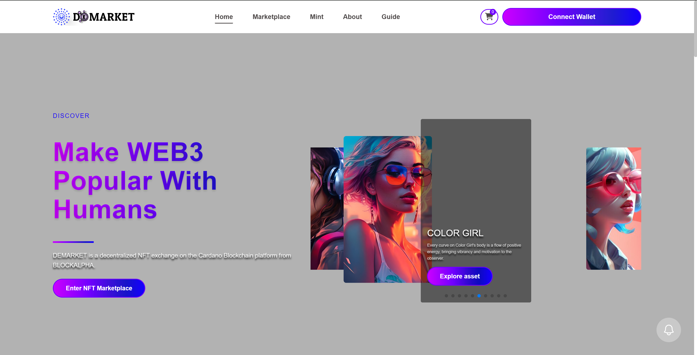
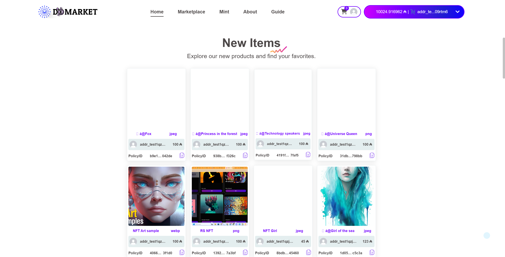
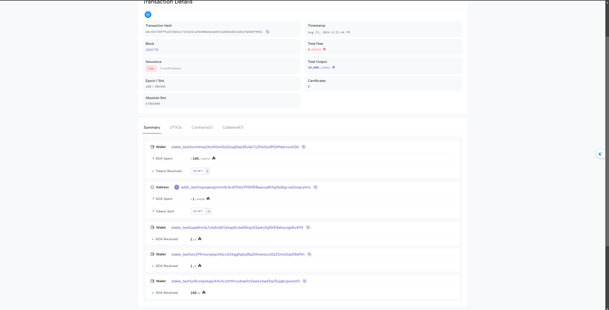
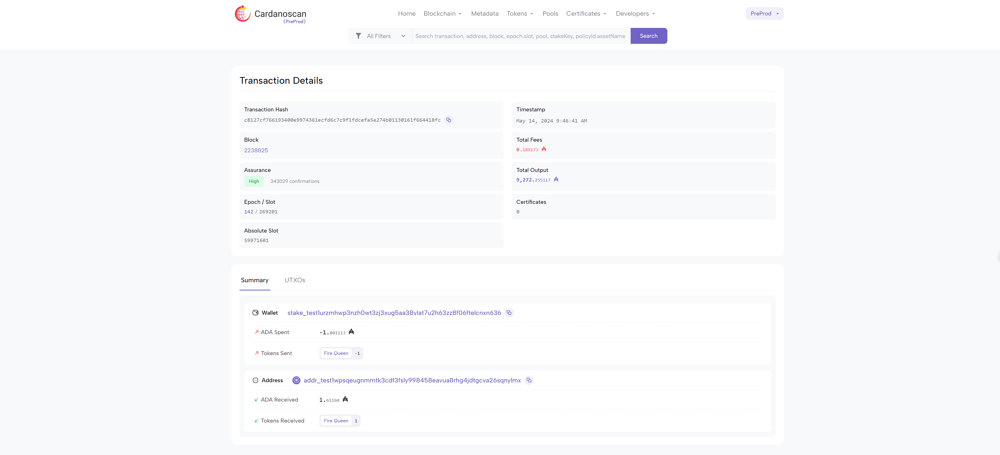
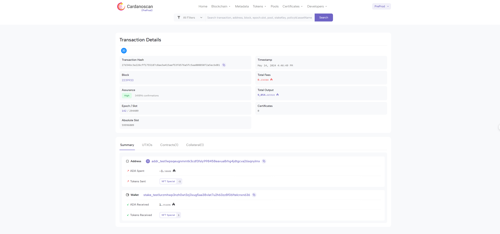

# Marketplace Smartcontract Frontend

Trong các bài học trước thì các bạn cũng đã viết hợp đồng thông minh marketplace và tương tác với hợp đồng này bằng commandline interface hôm nay tôi sẽ giới thiệu cho các bạn bài học thú vị hơn đó là tương tác với hợp đông thông minh marketplace này bằng giao diện frontend

# Nội dung bài học

1. Cài đặt một dự án frontend (`nextjs`)
2. Cách lấy file `plutus.json` và đọc `validator` được biên dịch trong khi biên dịch hợp đồng thông minh
3. Định nghĩa `Datum` và `Redeemer` ứng với hợp đồng thông minh
4. Tạo một giao diện cơ bản
5. Thực hiện kết nối ví (Nami)
6. Viết các hàm `Buy`, `Sell`, `Refund` để tương tác với hợp đồng
7. Tương tác giao diện với hợp đồng thông minh

### 1. Cài đặt dự án frontend - nextjs

Trong dự án này chúng ta sẻ sử dụng `Nextjs` làm công cụ để xây dựng ra các tính năng tương tác với hợp đồng thông minh `hello world` để có thể sử dụng được `Nextjs` thì điểu kiên tiên quyết phải có là `Nodejs` bằng cách kiểm tra

```sh
node --version
> v18.17.0
```

`NodeJs` nên sử dụng ưu tiên từ `version 16` trở nên. đồng thời với `Nodejs` là `npm` và `npx`. Được rồi để tạo dự án chúng ta cần sử dụng.

```sh
npx create-next-app@latest marketplace-frontend
cd marketplace-frontend
npm run dev
```

Dự án được chạy trên PORT 3000 như vậy dự án được cài đặt thành công. Trong dự án này còn có hai thư viện quan trong khác cần phải được cài đặt đó là `lucid-cardano` và `cbor-x`. Hai thư viện này chịu trách nhiệm chính trong việc tương tác với hợp đồng thông minh. Khi đã cài đặt thành công hay bắt đầu một bài học thú vị hơn.

```sh
npm install lucid-cardano cbor-x
```

### 2. Cách lấy file `plutus.json` và đọc `validator` được biên dịch trong khi biên dịch hợp đồng thông minh

Khi `aiken build` thì chúng ta cũng đã biên địch được hợp đồng và từ đó file `plutus.json` được tạo. Tiếp đến thực hiện việc copy file và đưa và dự án `frontend` bằng cách tạo thư mục `libs` trong `src`.

giờ đây chỉ cần viết một hàm đọc `validator`

```ts
import { encode } from "cbor-x";
import { SpendingValidator, fromHex, toHex } from "lucid-cardano";
import marketplace from "~/libs/marketplace.json";

const readValidator = function (): SpendingValidator {
    // Tìm validator trong hợp đồng thông minh marketplace
    const marketplaceValidator = marketplace.validators.find(function (
        validator
    ) {
        return validator.title === "contract.hello_world";
    });

    // Kiểm tra sự tồn tại của validator
    if (!marketplaceValidator) {
        throw new Error("Hello world validator not found.");
    }

    // Endcode validator từ hợp đồng bằng cbor-x để lucid có thể hiểu và tương tác với chúng
    const marketplaceScript: string = toHex(
        encode(fromHex(marketplaceValidator.compiledCode))
    );

    // Trả về định dạng của validator để tương tác với hợp đồng
    return {
        type: "PlutusV2",
        script: marketplaceScript,
    };
};

export default readValidator;
```

Trong đây, Hàm đọc `validator` thực chất thực hiện đọc trình xác thực từ bản thiết kế (`plutus.json`) mà chúng ta đã tạo trước đó. Chúng tôi cũng cần chuyển đổi nó sang định dạng mà `Lucid` có thể hiểu được. Điều này được thực hiện bằng cách tuần tự hóa trình xác nhận và sau đó chuyển đổi nó thành chuỗi văn bản thập lục phân.

### 3. Định nghĩa Datum và Redeemer ứng với hợp đồng thông minh

Thực hiện tạo folder `constants` trong thư mục `src` sau đó thực hiện tạo các file `datum.ts` và `redeemer.ts` với mục đích xây dựng ra các điều kiện đầu vào cho hợp đồng thông minh. Định nghĩa các `Datum` ứng với các giá trị mà chúng ta đã định nghĩa `Datum` trong hợp đồng và khi đưa vào Lucid nó có thể hiểu được. Định nghĩa một `Datum`

-   `seller` có kiểu dữ liệu là `ByteArray` map với kiểu `String`.
-   `policyId` có kiểu dữ liệu là `ByteArray` map với kiểu `string`.
-   `assetName` có kiểu dữ liệu là `ByteArray` map với kiểu `string`.
-   `author` có kiểu dữ liệu là `ByteArray` map với kiểu `string`.
-   `price` có kiểu dữ liệu là `Int` map với kiểu `BigInt`.
-   `royalties` có kiểu dữ liệu là `Int` map với kiểu `BigInt`.

Sau đó thực hiện `export` để sử dụng cho các điều kiên giao dịch. `Datum` là một phần thông tin có thể được liên kết với `UTXO` và được sử dụng để mang thông tin trạng thái tập lệnh như chủ sở hữu của nó hoặc chi tiết thời gian

```ts
import { Data } from "lucid-cardano";

const MarketplaceDatumSchema = Data.Object({
    policyId: Data.Bytes(),
    assetName: Data.Bytes(),
    seller: Data.Bytes(),
    author: Data.Bytes(),
    price: Data.Integer(),
    royalties: Data.Integer(),
});

export type MarketplaceDatum = Data.Static<typeof MarketplaceDatumSchema>;
export const MarketplaceDatum =
    MarketplaceDatumSchema as unknown as MarketplaceDatum;
```

Tương tự với `Datum` , `Redeemer` được định nghĩa là giống như một chiếc chìa khóa giúp mở khóa các utxos bị khóa trong tập lệnh. Với dữ liệu chính xác và giá trị quy đổi, utxo sau đó có thể được mở khóa để chi tiêu trong đây kiểu `Data.void()` được sử dụng để thực hiện để mở khóa hợp đồng thông minh.

```ts
import { Data } from "lucid-cardano";

const MarketplaceRedeemer = Data.void();

export { MarketplaceRedeemer };
```

### 4. Tạo một giao diện cơ bản

Trong bài học này chúng tôi sẽ thực hiện cung cấp cho bạn một giao diện để tương tác với hợp đồng thông minh. Giao diện được hiển thị như sau:



### 5. Thực hiện kết nối ví

Thực hiện tạo folder `contexts` trong thư mục `src` sau đó viết các chức năng connect wallet và disconnect wallet thông qua Lucid và Api của blockfrost

```tsx
"use client";

import React, { ReactNode, useContext, useState, useEffect } from "react";
import WalletContext from "~/contexts/components/WalletContext";
import { WalletType } from "~/types/GenericsType";
import { LucidContextType } from "~/types/contexts/LucidContextType";
import LucidContext from "~/contexts/components/LucidContext";
import { Blockfrost, Lucid, Network, UTxO } from "lucid-cardano";
import wallets from "~/constants/wallets";
import { NetworkContextType } from "~/types/contexts/NetworkContextType";
import NetworkContext from "~/contexts/components/NetworkContext";
import { networks } from "~/constants/networks";
import checkNetwork from "~/helpers/check-network";
import { ModalContextType } from "~/types/contexts/ModalContextType";
import ModalContext from "../components/ModalContext";

type Props = {
    children: ReactNode;
};

const WalletProvider = function ({ children }: Props) {
    const { lucid, setLucid } = useContext<LucidContextType>(LucidContext);
    const {
        toogleErrorNetwork,
        isShowingErrorNetwork,
        isShowingWallet,
        toggleShowingWallet,
        isShowingTestNetwork,
        toggleTestNetwork,
    } = useContext<ModalContextType>(ModalContext);
    const [wallet, setWallet] = useState<WalletType>(null!);
    const [loading, setLoading] = useState<boolean>(false);
    const { network } = useContext<NetworkContextType>(NetworkContext);

    useEffect(() => {
        const walletConnecttion = localStorage.getItem("wallet");
        if (walletConnecttion) {
            const walletConnected = JSON.parse(walletConnecttion);
            wallets.forEach(async function (wallet) {
                if (wallet.name.toLowerCase() === walletConnected.name) {
                    await connect({
                        name: wallet.name,
                        api: wallet.api,
                        checkApi: wallet.checkApi,
                        image: wallet.image,
                    });
                    return;
                }
            });
        }
        //  react-hooks/exhaustive-deps
    }, []);

    useEffect(() => {
        if (wallet) {
            localStorage.setItem(
                "wallet",
                JSON.stringify({
                    name: wallet.name.toLowerCase(),
                    connectedAt: new Date().getTime(),
                })
            );
        }
        // react-hooks/exhaustive-deps
    }, [wallet]);

    const connect = async function ({ name, api, image }: WalletType) {
        try {
            setLoading(true);
            const currentNetwork = networks.find(function ({ networkName }) {
                return networkName === network;
            });

            const lucid = await Lucid.new(
                new Blockfrost(
                    currentNetwork?.url as string,
                    currentNetwork?.apiKey as string
                ),
                currentNetwork?.networkName as Network
            );

            lucid.selectWallet(await api());
            const address: string = (await lucid.wallet.address()) as string;
            const networkConnection: Network = checkNetwork({
                address: address as string,
                pattern: "test",
            });
            if (networkConnection !== network && !isShowingErrorNetwork) {
                toggleShowingWallet();
                toogleErrorNetwork();
                return;
            }

            if (network === "Preprod" && !isShowingTestNetwork) {
                toggleTestNetwork();
            }

            const stakeKey: string =
                (await lucid.wallet.rewardAddress()) as string;
            const utxos: Array<UTxO> =
                (await lucid.wallet.getUtxos()) as Array<UTxO>;
            const { poolId } = await lucid.delegationAt(stakeKey as string);
            const balance: number = utxos.reduce(function (
                balance: number,
                utxo: UTxO
            ) {
                return balance + Number(utxo.assets.lovelace) / 1000000;
            },
            0);

            setWallet(function (previous: WalletType) {
                return {
                    ...previous,
                    name: name,
                    image: image,
                    address: address,
                    balance: balance,
                    stakeKey: stakeKey,
                    poolId: poolId,
                };
            });
            setLucid(lucid);
        } catch (error) {
            console.log(error);
        } finally {
            setLoading(false);
        }
    };

    const disconnect = async function () {
        try {
            setWallet(null!);
            setLucid(null!);
            if (isShowingErrorNetwork) {
                toogleErrorNetwork();
            }

            localStorage.removeItem("wallet");
        } catch (error) {
            console.log(error);
        }
    };

    const refresh = async function () {
        try {
            setLoading(true);
            const address: string = await lucid.wallet.address();
            const stakeKey: string =
                (await lucid.wallet.rewardAddress()) as string;
            const utxos: Array<UTxO> = await lucid.wallet.getUtxos();
            const { poolId } = await lucid.delegationAt(stakeKey as string);
            const balance: number = utxos.reduce(function (balance, utxo) {
                return balance + Number(utxo.assets.lovelace) / 1000000;
            }, 0);

            setWallet(function (previous: WalletType) {
                return {
                    ...previous,
                    address: address,
                    balance: balance,
                    stakeKey: stakeKey,
                    poolId: poolId,
                };
            });
        } catch (error) {
            console.log(error);
        } finally {
            setLoading(false);
        }
    };
    return (
        <WalletContext.Provider
            value={{ connect, wallet, disconnect, refresh, loading }}
        >
            {children}
        </WalletContext.Provider>
    );
};

export default WalletProvider;
```

Bây giờ, chúng ta có thể hướng tới vòi Cardano để nhận một số tiền trên mạng xem trước tới địa chỉ mới được tạo của chúng tôi (bên trong me.addr).


Đảm bảo chọn "Preview Testnet" làm mạng. Thực hiên copy địa chỉ mà đã sinh ra từ trước và paste vào để nhận một số đồng tiền test. Sử dụng `CardanoScan` chúng ta có thể theo dõi vòi gửi một số ADA theo cách của chúng ta. Quá trình này sẽ khá nhanh (vài giây). Bây giờ chúng ta đã có một số tiền, chúng ta có thể khóa chúng trong hợp đồng mới tạo của mình. Chúng tôi sẽ sử dụng `Lucid` để xây dựng và gửi giao dịch của chúng tôi thông qua `Block Frost`. Đây chỉ là một ví dụ về khả năng thiết lập bằng các công cụ mà chúng tôi yêu thích. Để biết thêm công cụ, hãy nhớ xem Cổng thông tin dành cho nhà phát triển Cardano! Đầu tiên, chúng tôi thiết lập Lucid với `Block Frost` làm nhà cung cấp. Điều này sẽ cho phép chúng tôi để `Lucid` xử lý việc xây dựng giao dịch cho chúng tôi, bao gồm cả việc quản lý các thay đổi. Nó cũng cung cấp cho chúng tôi một cách trực tiếp để gửi giao dịch sau này.

Lưu ý rằng dòng được đánh dấu ở trên sẽ tìm kiếm một biến môi trường có tên `BLOCKFROST_PROJECT_ID` mà giá trị của nó phải được đặt thành id dự án `Block Frost` của bạn. Bạn có thể xác định một biến môi trường mới trong thiết bị đầu cuối của mình bằng cách chạy (trong cùng phiên bạn cũng đang thực thi tập lệnh):

```sh
export BLOCKFROST_PROJECT_ID=preprody7qLCi4kIiAUEFRlJvmZ2PTi6jreF7gI
```


Bây giờ hãy tạo một folder `components` sau đó thực hiện hiết `Smartcontract.ts` Đây chính là nơi để thực hiện tương tác trực tiếp với họp đồng thông minh thông qua giao diện.

```tsx
"use client";

import React, { ChangeEvent, useContext, useState } from "react";
import Image from "next/image";
import Link from "next/link";
import { CopyToClipboard } from "react-copy-to-clipboard";
import classNames from "classnames/bind";
import Modal from "~/components/Modal";
import icons from "~/assets/icons";
import configs from "~/configs";
import styles from "./ConnectWallet.module.scss";
import wallets from "~/constants/wallets";
import { WalletType } from "~/types/GenericsType";
import WalletItem from "~/components/WalletItem";
import Button from "~/components/Button";
import { LucidContextType } from "~/types/contexts/LucidContextType";
import LucidContext from "~/contexts/components/LucidContext";
import { WalletContextType } from "~/types/contexts/WalletContextType";
import WalletContext from "~/contexts/components/WalletContext";
import convertString from "~/helpers/convert-string";
import Tippy from "~/components/Tippy";
import { NetworkContextType } from "~/types/contexts/NetworkContextType";
import NetworkContext from "~/contexts/components/NetworkContext";
import { ModalContextType } from "~/types/contexts/ModalContextType";
import ModalContext from "~/contexts/components/ModalContext";

const cx = classNames.bind(styles);
type Props = {
    className?: string;
};

const ConnectWallet = function ({ className }: Props) {
    const {
        isShowingErrorNetwork,
        toogleErrorNetwork,
        isShowingWallet,
        toggleShowingWallet,
        isShowingTestNetwork,
        toggleTestNetwork,
    } = useContext<ModalContextType>(ModalContext);
    const { network } = useContext<NetworkContextType>(NetworkContext);
    const { lucid } = useContext<LucidContextType>(LucidContext);
    const { wallet, disconnect } = useContext<WalletContextType>(WalletContext);
    const [accept, setAccept] = useState<boolean>(false);
    const [isCopied, setIsCopied] = useState<boolean>(false);
    const [isShowTippy, setIsShowTippy] = useState<boolean>(false);

    const handleAccept = function (event: ChangeEvent<HTMLInputElement>) {
        setAccept(event.target.checked);
    };

    return (
        <div className={cx("wrapper", className)}>
            <Tippy
                onHide={() => setIsShowTippy(false)}
                onShow={() => setIsShowTippy(lucid ? true : false)}
                offset={[0, 0]}
                className={cx("tippy-wallet")}
                trigger="click"
                interactive
                placement="bottom-start"
                render={
                    <div>
                        {wallet && (
                            <section className={cx("wallet-open")}>
                                <div className={cx("top-wallet")}>
                                    <div className={cx("icon-wallet")}>
                                        <Image
                                            className={cx("icon-wallet-image")}
                                            src={wallet?.image}
                                            alt=""
                                        />
                                    </div>
                                    <div className={cx("data-wallet")}>
                                        <div className={cx("data-wallet-top")}>
                                            <p
                                                className={cx(
                                                    "data-wallet-top-name"
                                                )}
                                            >
                                                {wallet.name}
                                            </p>
                                            <p
                                                className={cx(
                                                    "data-wallet-top-network"
                                                )}
                                            >
                                                <span
                                                    className={cx("dot")}
                                                ></span>
                                                {network}
                                            </p>
                                        </div>
                                        <div
                                            className={cx(
                                                "data-wallet-address"
                                            )}
                                        >
                                            {convertString({
                                                inputString: String(
                                                    wallet.address
                                                ),
                                                numberOfFirstChar: 13,
                                                numberOfLastChar: -16,
                                            })}
                                            <Tippy
                                                hideOnClick={false}
                                                placement={"top-end"}
                                                render={
                                                    isCopied ? (
                                                        <div>Copied.</div>
                                                    ) : (
                                                        <div>
                                                            Copy to clipboard.
                                                        </div>
                                                    )
                                                }
                                            >
                                                <CopyToClipboard
                                                    onCopy={() =>
                                                        setIsCopied(true)
                                                    }
                                                    text={
                                                        wallet?.address as string
                                                    }
                                                >
                                                    <Image
                                                        className={cx(
                                                            "icon-help-circle"
                                                        )}
                                                        src={icons.copy}
                                                        width={18}
                                                        height={18}
                                                        alt=""
                                                    />
                                                </CopyToClipboard>
                                            </Tippy>
                                        </div>
                                    </div>
                                </div>
                                <div className={cx("item-wallet")}>
                                    <section className={cx("item-icon")}>
                                        <Image
                                            className={cx("item-icon-image")}
                                            src={icons.cardanoChartCoin}
                                            alt=""
                                        />
                                    </section>
                                    <section className={cx("item-data")}>
                                        <div className={cx("item-data-name")}>
                                            <p
                                                className={cx(
                                                    "item-data-name-symbol"
                                                )}
                                            >
                                                ADA
                                            </p>
                                            <p
                                                className={cx(
                                                    "item-data-name-description"
                                                )}
                                            >
                                                Cardano
                                            </p>
                                        </div>
                                        <div className={cx("data-number")}>
                                            {wallet?.balance?.toFixed(5)}{" "}
                                        </div>
                                    </section>
                                </div>

                                <div
                                    onClick={disconnect}
                                    className={cx("disconnect")}
                                >
                                    Disconnect
                                </div>
                            </section>
                        )}
                    </div>
                }
            >
                <Button
                    onClick={toggleShowingWallet}
                    className={cx("connect-wallet-button", {
                        "wallet-show": isShowTippy && wallet,
                        isShowingErrorNetwork: isShowingErrorNetwork,
                    })}
                >
                    {lucid ? (
                        <div>
                            <section
                                className={cx("connected-wallet-container")}
                            >
                                <div
                                    className={cx("connected-wallet-total-ada")}
                                >
                                    {wallet?.balance &&
                                        wallet.balance.toFixed(6)}{" "}
                                    {" ₳"}
                                </div>

                                <div
                                    className={cx(
                                        "connected-wallet-image-container"
                                    )}
                                >
                                    <Image
                                        className={cx("connected-wallet-image")}
                                        src={wallet?.image}
                                        alt="image-connected"
                                    />
                                </div>
                                <div className={cx("connected-wallet-address")}>
                                    {convertString({
                                        inputString: String(wallet?.address),
                                        numberOfFirstChar: 7,
                                        numberOfLastChar: -6,
                                    })}
                                </div>
                                <div
                                    className={cx(
                                        "connected-wallet-icon-container"
                                    )}
                                >
                                    <Image
                                        className={cx("connected-wallet-icon")}
                                        src={icons.arrowBottom}
                                        alt=""
                                    />
                                </div>
                            </section>
                        </div>
                    ) : (
                        <span>
                            {isShowingErrorNetwork
                                ? "Wrong Network"
                                : "Connect Wallet"}
                        </span>
                    )}
                </Button>
            </Tippy>

            {!lucid && (
                <Modal isShowing={isShowingWallet} toggle={toggleShowingWallet}>
                    <div className={cx("connect-wallet-wrapper")}>
                        <section
                            onClick={toggleShowingWallet}
                            className={cx("connect-wallet-close")}
                        >
                            <Image
                                className={cx("connect-wallet-close-icon")}
                                src={icons.close}
                                alt=""
                            />
                        </section>
                        <section className={cx("connect-wallet-title")}>
                            <h1>Connect Wallet</h1>
                        </section>
                        <section className={cx("connect-wallet-accept")}>
                            <div className={cx("connect-wallet-input")}>
                                <input
                                    onChange={handleAccept}
                                    type="checkbox"
                                    placeholder=""
                                    className={cx("connect-wallet-checkbox")}
                                />
                            </div>
                            <label
                                className={cx("connect-wallet-input")}
                                htmlFor=""
                            >
                                By checking this box and connecting my wallet, I
                                confirm that I have read, understood, and agreed
                                to the
                                <Link
                                    className={cx("connect-wallet-input-link")}
                                    target="_blank"
                                    href={configs.routes.about}
                                >
                                    Terms and Conditions
                                </Link>.
                            </label>
                        </section>
                        <section className={cx("connect-wallet-container")}>
                            {wallets.map(function (
                                wallet: WalletType,
                                index: number
                            ) {
                                return (
                                    <WalletItem
                                        wallet={wallet}
                                        key={index}
                                        accept={accept}
                                    />
                                );
                            })}
                        </section>
                    </div>
                </Modal>
            )}

            <Modal
                toggle={toogleErrorNetwork}
                isShowing={isShowingErrorNetwork}
            >
                <div className={cx("connect-wallet-error-wrapper")}>
                    <h2 className={cx("connect-wallet-error-title")}>
                        Wallet Network Error
                    </h2>
                    <p className={cx("connect-wallet-error-description")}>
                        Please change the network to preprod or disconnect
                    </p>
                    <div className={cx("connect-wallet-error-button-wrapper")}>
                        <Button
                            onClick={disconnect}
                            className={cx("connect-wallet-error-button")}
                        >
                            Disconnect
                        </Button>
                    </div>
                </div>
            </Modal>
        </div>
    );
};

export default ConnectWallet;
```

Trước tiên hay thực hiện các chức năng kết nối ví. Trong đây mình sẽ sử dụng `Nami` là ví chính để thực hiện tương tác với cardano.

### 5. Thực hiện Mua tài sản từ hợp đồng thông minh

Khi đã kết nối ví thành công các bạn thực hiện viết chức năng để tương tác với hợp đồng thông minh thông qua lucid và api của blockfrost. Trước tiên mình sẽ thực hiện mua một NFT trên sàn với giá là 100 ada. Mình sẽ thực hiện sử dụng api của koios và blockfrost để thực hiện tương tác với hợp đồng thông minh để hiển thị các tài sản có trong hợp đồng thông minh và được kết quả.



Sau đây là mã để thực hiện giao dịch. Đầu tiên mình sẽ thực hiện đọc validator từ hàm validator được viết từ trước đó. sau đó mình sẽ thực hiện đọc địa chỉ hợp đồng thông qua validator từ hợp đồng thông minh. sau đó mình sẽ thực hiện tìm các tài sản có mà mình muốn lấy thông qua policyId và assetname. Tiếp đến sẽ thực hiện viết một giao dịch để thực hiện đưa tài sản về gồm địa chỉ ví người nhận địa chỉ ví sàn và địa chỉ ví của tác giả.

```ts
const buy = async function ({
    lucid,
    products,
}: {
    lucid: Lucid;
    products: ProductType[];
}) {
    const validator: Script = readValidator();
    const contractAddress: string = lucid.utils.validatorToAddress(validator);
    const scriptUtxos: UTxO[] | any = await lucid.utxosAt(contractAddress);

    let utxos = [];
    for (let i = 0; i < products.length; i++) {
        for (let u = 0; u < scriptUtxos.length; u++) {
            const temp = Data.from<MarketplaceDatum>(
                scriptUtxos[u].datum,
                MarketplaceDatum
            );
            if (
                temp.policyId === products[i].policyId &&
                temp.assetName === products[i].assetName
            ) {
                utxos.push(scriptUtxos[u]);
            }
        }
    }

    const utxoOuts: any = utxos.map(function (utxo: any) {
        return Data.from<MarketplaceDatum>(utxo.datum, MarketplaceDatum);
    });

    let tx: any = await lucid.newTx();

    for (let i = 0; i < utxos.length; i++) {
        let exchange_fee = BigInt((parseInt(utxoOuts[i].price) * 1) / 100);
        tx = await tx
            .payToAddress(String(products[i].sellerAddress), {
                lovelace: utxoOuts[i].price as bigint,
            })
            .payToAddress(
                "addr_test1qqayue6h7fxemhdktj9w7cxsnxv40vm9q3f7temjr7606s3j0xykpud5ms6may9d6rf34mgwxqv75rj89zpfdftn0esq3pcfjg",
                {
                    lovelace: exchange_fee as bigint,
                }
            )
            .payToAddress(String(products[i].authorAddress), {
                lovelace: utxoOuts[i].royalties as bigint,
            });
    }

    tx = await tx
        .collectFrom(utxos, MarketplaceRedeemer)
        .attachSpendingValidator(validator)
        .complete();
    const signedTx = await tx.sign().complete();

    const txHash: string = await signedTx.submit();
    await lucid.awaitTx(txHash);
};
```

Sau đó mình sẽ thực hiện mua nft rs với giá là 100 ada và thực hiện kí giao dịch. Mình sẽ thực hiện kí giao dịch thông qua nami wallet. Sau khi kí giao dịch thành công thì transaction hash sẽ được in ra và quá trình giao dịch của mình được thực hiện thành công



### 6. Thực hiện bán tài sản khỏi hợp đồng thông minh

trước tiên bạn cần vào trong ví và thực hiện kiếm tra xem trong ví đã tồn tài NFT hay chưa nếu chưa tồn tại thì có thể lên các trang mint nft để thực hiện đúc nft. Khi đã có nft mà muốn thực hiện bán nft đó thì hãy nhập policy id và assetname mà bạn muốn bán vào trong cùng với giá để thực hiện giao dịch

```ts
const sell = async function ({
    policyId,
    assetName,
    authorAddress,
    price,
    royalties,
    lucid,
}: {
    policyId: string;
    assetName: string;
    authorAddress: string;
    price: bigint;
    royalties: bigint;
    lucid: Lucid;
}) {
    const validator: Script = readValidator();
    const contractAddress: string = lucid.utils.validatorToAddress(validator);

    const sellerPublicKey: string = lucid.utils.getAddressDetails(
        await lucid.wallet.address()
    ).paymentCredential?.hash as string;
    const authorPublicKey: string = lucid.utils.getAddressDetails(
        authorAddress as string
    ).paymentCredential?.hash as string;

    const datum = Data.to(
        {
            policyId: policyId,
            assetName: assetName,
            seller: sellerPublicKey,
            author: authorPublicKey,
            price: price,
            royalties: royalties,
        },
        MarketplaceDatum
    );

    const tx = await lucid
        .newTx()
        .payToContract(
            contractAddress,
            { inline: datum },
            { [policyId + assetName]: BigInt(1) }
        )
        .complete();
    const signedTx = await tx.sign().complete();
    const txHash = await signedTx.submit();
    const success = await lucid.awaitTx(txHash);
};
```

Khi các bạn thực hiện bán tài sản thành công thì sẽ có giao dịch giống như trong ví dụ



### 7. Người bán thực hiện lấy lại tài sản khi bán vào hợp đồng thông minh

trong đây các bạn sẽ thực hiện viết chức năng để lấy lại tài sản khi bán vào trong hợp đồng thông minh. nếu bạn là tác giá thì bạn sẽ lấy tài sản của bạn về thông qua policyId và assetName của tài sản mà bạn muốn lấy về

```tsx
const refund = async function ({
    lucid,
    policyId,
    assetName,
}: {
    lucid: Lucid;
    policyId: PolicyId;
    assetName: string;
}) {
    try {
        const validator: Script = readValidator();

        const scriptAddress: string = lucid.utils.validatorToAddress(validator);
        const scriptUtxos = await lucid.utxosAt(scriptAddress);
        let existAsset: any;

        const utxos = scriptUtxos.filter((asset: any, index: number) => {
            const checkAsset = Data.from<MarketplaceDatum>(
                asset.datum,
                MarketplaceDatum
            );
            if (
                checkAsset.policyId === policyId &&
                checkAsset.assetName === assetName
            ) {
                existAsset = Data.from<MarketplaceDatum>(
                    asset.datum,
                    MarketplaceDatum
                );
                return true;
            }
            return false;
        });

        const tx = await lucid
            .newTx()
            .collectFrom(utxos, MarketplaceRedeemer)
            .addSigner(await lucid.wallet.address())
            .attachSpendingValidator(validator)
            .complete();

        const signedTx = await tx.sign().complete();
        const txHash = await signedTx.submit();
        const success = await lucid.awaitTx(txHash);
        if (success) {
            setTxHashRefund(txHash);
        }
    } catch (error) {
        console.log(error);
    } finally {
        setWaiting(false);
    }
};
```

Sau đây là kết quả nếu như các bạn thực hiện refund tài sản về như vậy là chúng ta đã hoàn thành ví dụ đưa tài sản về ví



Hy vọng điều này mang lại cho bạn ý tưởng về những gì bạn có thể xây dựng trên Cardano. Ví dụ này cũng sẽ minh họa cách hầu hết mã trong dapp của bạn thậm chí không phải là trình xác thực. Khi thiết kế các ứng dụng tận dụng Cardano, tốt hơn hết bạn nên suy nghĩ về loại giao dịch nào bạn sẽ cần xây dựng và sau đó viết trình xác thực để thực thi chúng. Một tài liệu tham khảo đầy đủ về ví dụ này có thể được tìm thấy ở đây.
